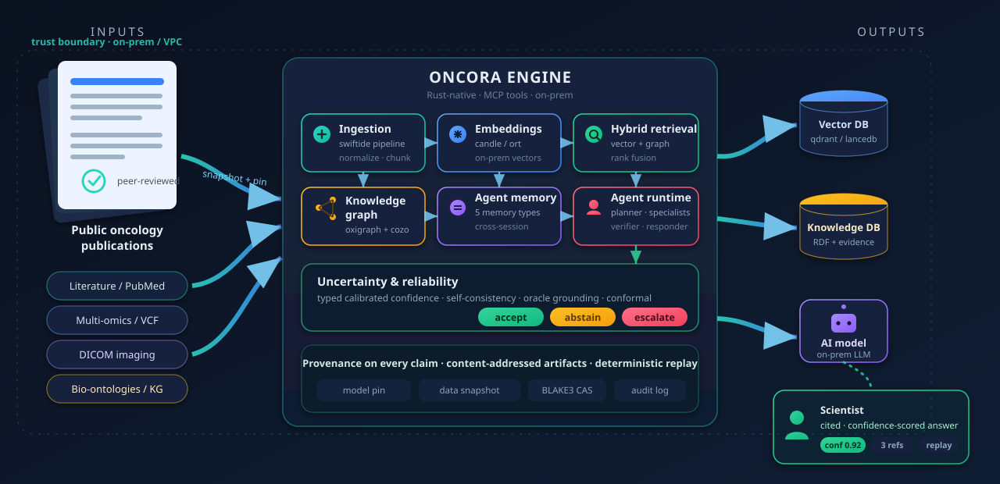
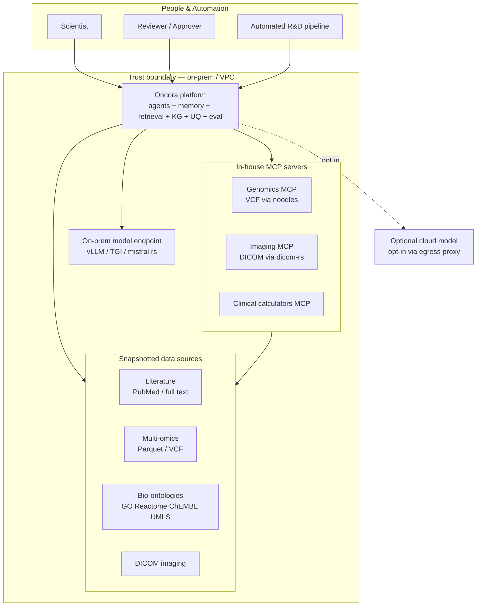

# Oncora

<p align="center">
  
</p>

**Oncora — A Reproducible, Uncertainty-Aware Agentic Reasoning Platform for Oncology Drug Discovery.**

Oncora (Oncology Reasoning Agents) is a **Rust-native, on-premise agentic AI platform** that helps scientists accelerate oncology drug discovery — novel target discovery, translational research, and clinical-trial design/matching. Autonomous and semi-autonomous reasoning agents reason across **literature, multi-omics, biomolecular knowledge graphs, and medical imaging**, reaching every domain capability through the **Model Context Protocol (MCP)**.

What makes Oncora different from a generic RAG chatbot is built into its architecture, not bolted on:

- **Reproducibility** — pinned models, pinned data snapshots, content-addressed artifacts (BLAKE3), and deterministic replay of any run.
- **Provenance on every claim** — each conclusion is traceable to its sources, tool calls, model pin, and data snapshot.
- **Typed, calibrated uncertainty** — confidence is a first-class value that flows through the system; agents **abstain or escalate** rather than confabulate.

> This repository contains the **architecture and technical specification** *and* a **compiling Cargo workspace** — the Phase-0 walking skeleton from [docs/08-roadmap.md](docs/08-roadmap.md) runs end to end. The crate layout follows [docs/07-repo-layout.md](docs/07-repo-layout.md).

### Build & run the walking skeleton

```bash
cargo run --bin oncora                 # ingest a tiny corpus, ask a target-discovery
                                       # question, print a cited, confidence-scored answer
cargo run --bin oncora -- "Is BRAF actionable in melanoma?" BRAF
cargo run --bin oncora-api             # HTTP API on :8080  (GET /health, /tools; POST /query)
cargo test --workspace                 # unit tests across all crates
cargo xtask ci                         # fmt --check + clippy -D warnings + tests
```

Trait-based swappability in action — the same `LedgerStore` trait, schema, and conformance
test run against three interchangeable backends, including **C SQLite vs pure-Rust SQLite**:

```bash
cargo test -p oncora-ledger                                  # in-memory backend
cargo test -p oncora-ledger --features sqlite-c              # C SQLite (rusqlite, bundled)
cargo test -p oncora-ledger --features sqlite-rust           # pure-Rust SQLite (turso)
cargo test -p oncora-ledger --features "sqlite-c sqlite-rust" # all three, side by side
```

The `ToolHost` seam is the same story for **real MCP**: `oncora-mcp-host` ships an in-memory
host by default and, under `--features rmcp`, an `rmcp`-backed MCP **server** (exposing Oncora's
tools) plus a **client** that routes an external MCP server's tools through the same `ToolHost`
trait — verified by an in-process loopback test:

```bash
cargo test -p oncora-mcp-host --features rmcp                # MCP server + client loopback
```

The `GraphStore` seam swaps the in-memory triple store for a real **Oxigraph** RDF quad store
(pure-Rust, in-process) — same conformance test, per-edge confidence preserved:

```bash
cargo test -p oncora-kg --features oxigraph                  # real RDF graph backend
```

And the `VectorStore` seam swaps the in-memory store for a real **qdrant** cluster
(`oncora-retrieval --features qdrant`). Its live round-trip test starts qdrant in Docker via
`testcontainers`, so it needs a Docker daemon (it runs in CI):

```bash
cargo test -p oncora-retrieval --features qdrant             # needs Docker (testcontainers)
```

The whole agent loop then runs **against that real qdrant** — same `Platform`, only the
`VectorStore` swapped — ingesting a corpus, retrieving from qdrant, and returning a cited,
confidence-scored answer:

```bash
docker run -d -p 6334:6334 qdrant/qdrant:v1.12.4
ONCORA_QDRANT_URL=http://127.0.0.1:6334 \
  cargo test -p oncora-agents --features qdrant -- --nocapture
# answer: NSCLC is the best-supported answer (agreement 100%, 2 sources)
# confidence: 0.935 · verdict: accept · citations: [PMID:0001, PMID:0002]
```

The `oncora-*` crates wire together behind the provider trait boundaries in
`oncora-core` (`ModelProvider`, `VectorStore`, `GraphStore`, `MemoryStore`, `ToolHost`,
`Calibrator`, `Verifier`, `ArtifactStore`, `EmbeddingProvider`). The walking skeleton ships
**in-memory reference backends** so it runs with no model server or external database;
production swaps in the real backends (vLLM/TGI, qdrant, oxigraph/cozo, redb, rmcp) behind the
same traits — see [docs/05-tech-decisions.md](docs/05-tech-decisions.md).

### Browse the docs as a website

The Markdown spec also renders as a styled static site with hand-authored SVG illustrations and live Mermaid diagrams (sources in [site/](site/), generator in [build/build_site.py](build/build_site.py)):

```bash
make setup    # one-time: create the build venv + markdown toolchain
make serve    # build the site and serve it at http://localhost:8137
```

The site is self-contained (Mermaid and highlight.js are vendored under `site/assets/js/`), so it works offline once served over http. The home page opens with a visual overview of how publications and multimodal data flow through the Oncora engine to the databases, AI model, and a cited, confidence-scored answer.

---

## System context



---

## Document map

| Document | What it covers |
|---|---|
| [docs/00-overview.md](docs/00-overview.md) | Executive summary, goals/non-goals, the four pillars, context diagram |
| [docs/01-architecture.md](docs/01-architecture.md) | Containers, components, agent runtime/orchestration, end-to-end workflow, all core diagrams |
| [docs/02-memory.md](docs/02-memory.md) | The agent memory architecture deep dive (5 memory types, write/read paths) |
| [docs/03-uncertainty-reliability.md](docs/03-uncertainty-reliability.md) | Typed uncertainty, calibration, verification, abstention/escalation |
| [docs/04-knowledge-and-data.md](docs/04-knowledge-and-data.md) | Multimodal ingestion, KG schema, hybrid retrieval, omics/imaging |
| [docs/05-tech-decisions.md](docs/05-tech-decisions.md) | Rust technology survey, decision tables, alternatives, risk register |
| [docs/06-eval-benchmarking.md](docs/06-eval-benchmarking.md) | Evaluation harness, golden sets, metrics, CI gating, publish-grade reproducibility |
| [docs/07-repo-layout.md](docs/07-repo-layout.md) | Cargo workspace, crate responsibilities, trait boundaries, repo tree |
| [docs/08-roadmap.md](docs/08-roadmap.md) | Deployment/scaling/ops, security/privacy/governance, phased roadmap |

---

## The four pillars

1. **Multimodal reasoning** — integrate and reason across text, structured omics, biomolecular knowledge graphs, and imaging. See [docs/04-knowledge-and-data.md](docs/04-knowledge-and-data.md).
2. **Agent memory architecture** — persistent knowledge retention and context-aware decisions across extended, multi-session workflows. See [docs/02-memory.md](docs/02-memory.md).
3. **Robustness & uncertainty** — calibrated uncertainty quantification; agents that know when they don't know and abstain or escalate. See [docs/03-uncertainty-reliability.md](docs/03-uncertainty-reliability.md).
4. **Reliability & benchmarking** — faster, more accurate, more reliable agents, benchmarked against human experts and computational baselines, reproducible enough to publish. See [docs/06-eval-benchmarking.md](docs/06-eval-benchmarking.md).

---

## Core technology choices

End-to-end Rust. Highlights (full survey and justification in [docs/05-tech-decisions.md](docs/05-tech-decisions.md)):

| Area | Primary choice |
|---|---|
| Async runtime / services | `tokio`, `axum`, `tonic`, `tower` |
| Agent orchestration | `rig` (behind in-house traits) + `swiftide` ingestion |
| Model access | `async-openai` (on-prem vLLM/TGI), `async-anthropic`; local `mistral.rs`/`candle`; `ort` for ONNX |
| Tools | MCP via `rmcp` |
| Vector search | `qdrant` (text), `lancedb` (multimodal/imaging) |
| Knowledge graph | `oxigraph` (RDF/SPARQL ontology) + `cozo` (evidence graph, Datalog, time-travel) |
| Omics / genomics | `polars`, `duckdb`, `arrow`, `noodles` |
| Imaging | `dicom-rs` |
| State / memory | `redb`, `sqlx` + Postgres; CAS over object store |
| Observability | `tracing` + OpenTelemetry |
| Reliability | `proptest`, `cargo-fuzz`, `insta`, `criterion` |

---

## Status & assumptions

- **Design phase.** This repo holds the specification; implementation follows the [roadmap](docs/08-roadmap.md), starting from a Phase 0 walking skeleton.
- Foundation models are the one unavoidable non-Rust dependency; they sit behind a `ModelProvider` trait and run on-prem by default. Any cloud endpoint is opt-in per deployment.
- In-house MCP servers for genomics (VCF), DICOM imaging, and clinical calculators are assumed to exist; Oncora composes and orchestrates them and hosts its own (KG, retrieval, memory).
- Data sources are snapshotted into the trust boundary; Oncora never writes to source data.
