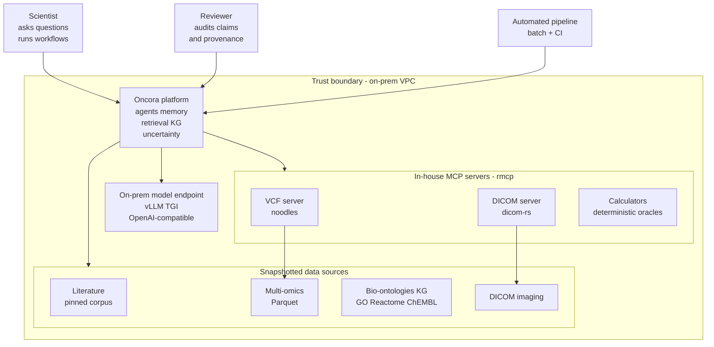

# Oncora — A Reproducible, Uncertainty-Aware Agentic Reasoning Platform for Oncology Drug Discovery

Oncora (Oncology Reasoning Agents) is a Rust-native, on-prem agentic platform that reasons across the heterogeneous evidence of oncology drug discovery — literature, multi-omics, biomolecular knowledge graphs, and clinical imaging — and returns answers that a scientist can actually trust. Every claim carries machine-checkable provenance back to a pinned data snapshot and a pinned model; every answer carries a typed, calibrated confidence; and when the evidence does not support a confident answer, Oncora abstains or escalates rather than confabulates. It is built to be reproducible enough to publish and reliable enough to put in front of a review board.

## Problem statement

Oncology drug discovery is a multimodal evidence-integration problem under deep uncertainty. A single decision — is this target druggable in this indication, does this variant confer resistance to this compound, is this trial design supported by the mechanistic evidence — depends on fusing peer-reviewed and preprint literature, structured multi-omics measurements, curated bio-ontologies and pathway graphs, and DICOM imaging, each with its own schema, vocabulary, noise model, and access constraints. The data is heterogeneous, versioned, frequently contradictory, and almost always governed by privacy and IP boundaries that forbid it leaving the institution.

A generic RAG chatbot fails here on every axis that matters. It treats retrieval as a top-k text lookup and ignores structured omics, graph relationships, and imaging entirely. It produces fluent prose with no durable, per-claim provenance, so a reviewer cannot audit *why* the system said what it said. It has no notion of calibrated uncertainty — it is equally confident when right and when hallucinating — and no principled way to abstain. It is non-reproducible: re-running the same question against a drifting index and a moving model gives different answers with no replay path. And it routinely leaks data to third-party endpoints. None of these are acceptable when the output feeds a go/no-go on a multi-year, multi-million-dollar program, or a manuscript, or a regulatory submission.

Oncora is the opinionated alternative: a typed reasoning system where uncertainty, provenance, and reproducibility are first-class values in the data model, not afterthoughts in the prompt.

## Goals

- Fuse the four oncology modalities — literature, multi-omics, biomolecular knowledge graph, imaging — into a single reasoning substrate, not four disconnected silos.
- Attach machine-checkable provenance to **every** claim: sources, tool calls, model pin, and data snapshot.
- Treat uncertainty as a typed, calibrated, first-class value that flows end to end and drives an explicit accept / abstain / escalate decision.
- Be reproducible enough to publish: pinned models, pinned data snapshots, content-addressed artifacts, and deterministic replay of any run.
- Persist and reuse knowledge across sessions through a principled, versioned agent memory architecture.
- Run entirely on-prem / in-VPC by default; PHI and IP never cross the trust boundary.
- Beat human experts and computational baselines on speed, accuracy, and reliability, and prove it with a benchmark harness that gates CI.
- Be Rust-native end to end, with all domain tools exposed through MCP.

## Non-goals

- Not a general-purpose chatbot or open-domain assistant.
- Not a cloud SaaS; no default external API calls, no third-party model endpoints without an explicit, audited egress proxy.
- Not a wet-lab automation, LIMS, or ELN replacement.
- Not a source-of-truth datastore for primary research data; Oncora reads snapshots and never writes back to source systems.
- Not a system that guesses to be helpful; silence (abstention) is a valid, logged outcome.
- Not a polyglot microservice zoo; non-Rust dependencies are isolated behind Rust traits and individually justified.

## The four pillars

### 1. Multimodal reasoning

Oncora reasons over text (literature), structured omics, the biomolecular knowledge graph, and imaging as one coherent evidence space. Specialist agents (genomics, literature, imaging, clinical) each operate on their native modality through dedicated MCP tools and stores — `qdrant` for text/RAG, `lancedb` for multimodal and imaging embeddings, `oxigraph`/`cozo` for the KG, `polars`/`duckdb` over Parquet for omics — and a hybrid retrieval layer fuses vector, graph, and recency signals into a single relevance score under a token budget. The result is cross-modal evidence assembly, not four parallel chatbots.

### 2. Agent memory architecture

Oncora retains what it learns and makes context-aware decisions across multi-session workflows. Five memory types — working, episodic, semantic, procedural, and provenance/evidence — are backed by purpose-fit stores (`redb` + CAS for working/episodic, `oxigraph`/`cozo` for semantic, `cozo` + manifests for procedural, Postgres + CAS for provenance) with a disciplined write path (extract → dedup → conflict-resolve → consolidate → decay) and hybrid read path. Memory is keyed by `(scientist, project, workflow)` and is itself reproducible, because every entry carries its snapshot and model pin.

### 3. Robustness & uncertainty

Oncora produces typed, calibrated confidence and prefers to abstain or escalate over confabulating. Confidence is post-hoc calibrated (tracked via ECE), uncertainty is decomposed into aleatoric / epistemic / retrieval / tool sources, and answers are grounded against deterministic oracles (calculators, KG) and checked for citation entailment. Conformal prediction yields set-valued outputs with an abstention guarantee; thresholds on calibrated confidence, conformal set size, and oracle disagreement drive an explicit `Verdict` of Accept, Abstain, or Escalate.

### 4. Reliability & benchmarking

Oncora is built to be faster, more accurate, and more reliable than human experts and computational baselines — and to prove it reproducibly. The `oncora-eval` harness runs golden sets, computes accuracy / calibration / abstention / latency metrics, and gates CI so regressions cannot merge. Pinned models, pinned snapshots, and content-addressed artifacts make every benchmark result a deterministic, replayable, publishable artifact.

### What makes this not a RAG chatbot

- **Reproducibility.** Every run pins its models and data snapshots and content-addresses its artifacts with BLAKE3, so any answer can be deterministically replayed and any benchmark result re-derived bit-for-bit. A RAG chatbot over a live, drifting index cannot.
- **Provenance on every claim.** Each claim carries a typed `Provenance { sources, tool_calls, model, snapshot }`, recorded to the provenance ledger and episodic memory. A reviewer can trace any sentence back to its sources and the exact tool calls that produced it — there is no unsourced prose.
- **Typed uncertainty and abstention.** Confidence is a calibrated `Confidence(f64)` with a calibration tag, not a vibe in the wording. The system carries uncertainty as a first-class value and can return `Verdict::Abstain` or `Verdict::Escalate` with a logged reason instead of inventing an answer.

## Cross-cutting non-negotiables

- **Rust-native end to end.** The whole stack is Rust; non-Rust dependencies are isolated behind Rust traits and individually justified.
- **MCP for all domain tools.** Every domain capability is an MCP tool served via `rmcp`; tool calls are deterministic and audited.
- **On-prem / privacy.** VPC-only by default; PHI and IP never leave the trust boundary; no writes to source data; cloud endpoints only through an explicit egress proxy.
- **Reproducibility.** Pinned models, pinned data snapshots, content-addressed artifacts (BLAKE3), deterministic replay.
- **Typed uncertainty.** Uncertainty is a typed, first-class value flowing through the system, and the system is allowed to abstain.

## System context

## Document map

| Doc | Description |
|---|---|
| [README.md](../README.md) | Project entry point, quickstart, and orientation. |
| [00-overview.md](00-overview.md) | This executive overview: problem, goals, four pillars, system context. |
| [01-architecture.md](01-architecture.md) | Agent runtime, orchestration topology, crate layout, and service mesh. |
| [02-memory.md](02-memory.md) | The five memory types and their write/read paths. |
| [03-uncertainty-reliability.md](03-uncertainty-reliability.md) | Uncertainty model, calibration, conformal prediction, abstention policy. |
| [04-knowledge-and-data.md](04-knowledge-and-data.md) | Knowledge graph schema, data sources, ingestion, and snapshotting. |
| [05-tech-decisions.md](05-tech-decisions.md) | Locked technology choices with primary/fallback and justifications. |
| [06-eval-benchmarking.md](06-eval-benchmarking.md) | Benchmark harness, golden sets, metrics, and CI gating. |
| [07-repo-layout.md](07-repo-layout.md) | Cargo workspace, crate dependency direction, and trait boundaries. |
| [08-roadmap.md](08-roadmap.md) | Phasing, milestones, and risk-gated rollout. |
