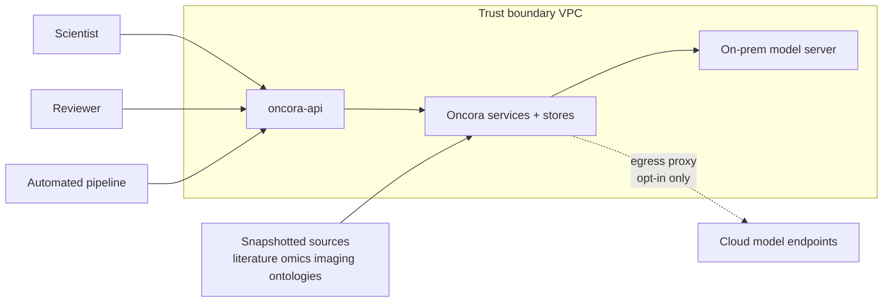
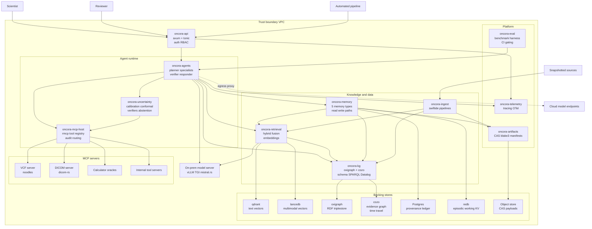
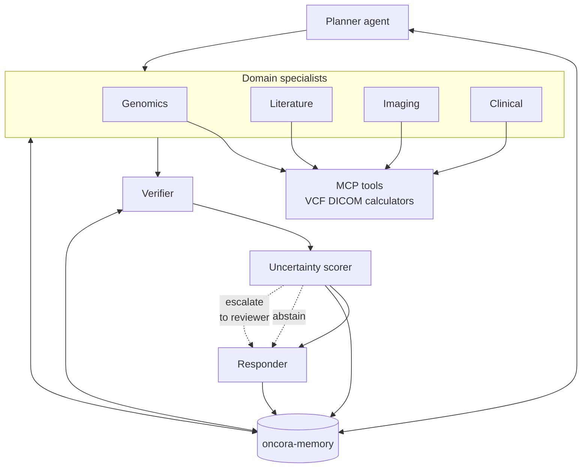
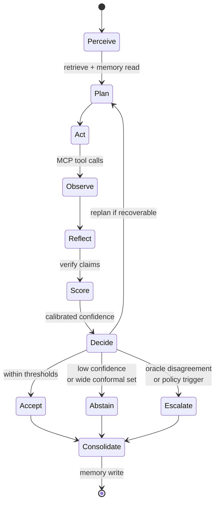
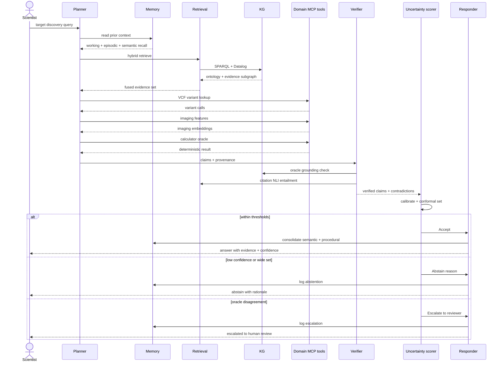

# 01 — Architecture

> Master architecture document for **Oncora** (Oncology Reasoning Agents).
> Authoritative decisions live in the internal design canon; this document operationalizes them.
> Deep-dives: [00-overview.md](00-overview.md) · [02-memory.md](02-memory.md) · [03-uncertainty-reliability.md](03-uncertainty-reliability.md) · [04-knowledge-and-data.md](04-knowledge-and-data.md) · [05-tech-decisions.md](05-tech-decisions.md) · [06-eval-benchmarking.md](06-eval-benchmarking.md) · [07-repo-layout.md](07-repo-layout.md) · [08-roadmap.md](08-roadmap.md)

Oncora is a **reproducible, uncertainty-aware agentic reasoning platform for oncology drug discovery**. It is Rust-native end to end, on-prem/VPC-only by default, and built around four pillars: multimodal reasoning, agent memory, robustness & uncertainty, and reliability & benchmarking. This document recaps the system context, presents the C4 container view, breaks down the component crates, specifies the agent runtime and orchestration, walks an end-to-end target-discovery workflow, and pins the trait boundaries that keep providers swappable.

---

## 1. System context & boundaries

### 1.1 Actors

| Actor | Role | Trust | Primary entry |
|---|---|---|---|
| **Scientist** | Initiates discovery workflows; consumes evidence-bearing answers; receives abstentions/escalations | Authenticated, inside boundary | `oncora-api` (HTTP/gRPC) |
| **Reviewer** | Human expert who adjudicates escalated decisions and approves promotions of semantic memory | Authenticated, inside boundary | `oncora-api` review queue |
| **Automated pipeline** | Scheduled/CI-driven runs: ingestion, re-indexing, benchmark gating, batch hypotheses | Service identity, inside boundary | `oncora-api` (gRPC) / `oncora-cli` |

### 1.2 Trust boundary

The trust boundary is the **VPC**. PHI and source data never leave it. Inside the boundary live every Oncora service, every backing store, the on-prem model server, and the internal MCP servers. The only sanctioned path out is an **explicit egress proxy** for opt-in cloud model endpoints; nothing else may dial outbound. Hard rules carried from the canon:

- **No writes to source data** — snapshots are read-only inputs.
- **Provenance on every claim** — each assertion carries sources, tool calls, model pin, snapshot id.
- **Deterministic, audited tool calls** — every MCP call is recorded to episodic memory and the provenance ledger.
- **Reproducibility** — pinned models, pinned data snapshots, content-addressed artifacts via BLAKE3, deterministic replay.

### 1.3 External model endpoints

Model inference is abstracted behind `ModelProvider`. The default is **on-prem** (vLLM/TGI OpenAI-compatible, or local `mistral.rs`/`candle`). Cloud endpoints (Anthropic, OpenAI-compatible) are **opt-in only** and reachable solely through the egress proxy; a run that touches a cloud endpoint records that fact in its model pin.

### 1.4 Snapshotted data sources

All knowledge inputs enter as **immutable, versioned snapshots** identified by a `SnapshotId`: literature corpora, omics/VCF datasets, imaging (DICOM) sets, and ontology dumps (GO, Reactome, ChEMBL, UMLS, MONDO, HGNC). Snapshots are the unit of reproducibility — a memory entry or claim is replayable because it pins the snapshot it was derived from.

---

## 2. C4 container diagram

The diagram preserves the canonical **dependency direction**: arrows point inward toward `oncora-core` (omitted as a node — it is the shared type/trait substrate every crate links). Backing stores and MCP servers are concrete providers behind core traits.

---

## 3. Component breakdown

Crates are namespaced `oncora-*` in a single Cargo workspace. Dependencies point inward toward `oncora-core`; **no cycles**. Foundational crates have no internal deps.

### oncora-core
The type and trait substrate. Defines canonical uncertainty types (`Confidence`, `Provenance`, `Evidence`, `Verdict`), ids, errors (`thiserror`), and the provider-swappable traits (§7). Everything depends on it; it depends on nothing internal.

### oncora-telemetry
Structured tracing and OpenTelemetry wiring (`tracing` + `tracing-opentelemetry` → OTel collector). Correlates agent runs into spans for audit and replay. Foundational, no internal deps.

### oncora-artifacts
Content-addressed store (CAS) over object store/filesystem. BLAKE3 hashing, `serde`/CBOR manifests. The backbone of deterministic replay — payloads (tool outputs, prompts, snapshots) are addressed by content hash. Depends on core. See [04-knowledge-and-data.md](04-knowledge-and-data.md).

### oncora-mcp-host
`rmcp` host/client, tool registry, and audit. Routes every domain tool call to the right MCP server, enforces determinism, and records calls to episodic memory + provenance ledger. Depends on core, telemetry.

### oncora-kg
The dual-store knowledge graph: `oxigraph` (RDF/SPARQL ontology layer) + `cozo` (Datalog evidence/assertion graph with time-travel and per-edge confidence). Owns the canonical KG schema. Depends on core. See [04-knowledge-and-data.md](04-knowledge-and-data.md).

### oncora-retrieval
Hybrid retrieval: vector search (`qdrant` for text/RAG, `lancedb` for multimodal/imaging) + graph queries (via `oncora-kg`) + recency/usage scoring, fused into a single relevance score. Hosts `fastembed`/`candle` embeddings behind `EmbeddingProvider`. Depends on core, kg.

### oncora-ingest
`swiftide`-based streaming pipelines for literature, omics, imaging, and KG ingestion. Reads immutable snapshots, writes to KG, retrieval indexes, and CAS. Never writes back to source. Depends on core, kg, retrieval, artifacts.

### oncora-memory
The five memory types — working, episodic, semantic, procedural, provenance — and the write/read paths (dedup → conflict resolution → consolidation → decay; hybrid read under token budget). Depends on core, kg, retrieval, artifacts. See [02-memory.md](02-memory.md).

### oncora-uncertainty
Calibrated confidence, calibration methods (post-hoc, ECE-tracked), conformal prediction, verifiers (citation grounding / NLI entailment, oracle grounding), and the abstention/escalation policy. Depends on core, mcp-host. See [03-uncertainty-reliability.md](03-uncertainty-reliability.md).

### oncora-agents
The `rig`-backed agent runtime: planner, domain specialists, verifier, uncertainty-scorer hook, responder, and the agent loop. Owns concurrency and MCP tool routing at the orchestration level. Depends on core, memory, retrieval, kg, mcp-host, uncertainty.

### oncora-eval
Benchmark harness, golden sets, metrics, and CI gating against human-expert and computational baselines. Depends on core, agents, and the rest. See [06-eval-benchmarking.md](06-eval-benchmarking.md).

### oncora-api
`axum` (HTTP) + `tonic` (gRPC) services, auth, RBAC. The sole entry point across the trust boundary. Depends on agents, memory, retrieval, kg.

### oncora-cli
Operator + developer CLI, including deterministic replay. Depends on api/agents. See [07-repo-layout.md](07-repo-layout.md).

---

## 4. Agent runtime & orchestration

### 4.1 Multi-agent topology

The orchestration is a fixed pipeline with memory read/written throughout: **Planner → Domain Specialists → Verifier → Uncertainty Scorer → Responder**. The planner decomposes the task and dispatches to specialists (genomics, literature, imaging, clinical) that call domain MCP tools. The verifier checks claims against retrieved sources and oracle outputs; the uncertainty scorer assigns calibrated confidence and computes a `Verdict`; the responder either answers, abstains, or escalates.

### 4.2 The agent loop

Each run executes a structured loop. Memory is **read at perceive** and **written at consolidate**; the loop terminates in one of three verdicts.

### 4.3 Concurrency model

Built on `tokio` with **structured concurrency per run**:

| Concern | Mechanism | Rationale |
|---|---|---|
| Cancellation | per-run `CancellationToken` | One token cancels the whole run subtree on timeout, abort, or client disconnect |
| Tool/model timeouts | `tower` timeout layers | Uniform, per-tool deadlines; no unbounded waits on an MCP server or model |
| Backpressure | bounded `tokio::mpsc` channels | Producers block rather than balloon memory; flow control between stages |
| Concurrency limits | `tokio::sync::Semaphore` | Cap concurrent model calls and per-server tool calls to protect GPUs and oracles |
| Structured scope | task tracker / `JoinSet` per run | Child tasks are owned by the run; nothing outlives its parent scope |

Specialists run concurrently under a shared semaphore; the planner fans out then joins. A cancelled or timed-out run propagates the `CancellationToken` so in-flight tool calls are dropped and recorded as such in episodic memory.

### 4.4 MCP tool routing

`oncora-mcp-host` is the single chokepoint for domain tools. It holds the `rmcp` tool registry, resolves a requested tool to its server (VCF/`noodles`, DICOM/`dicom-rs`, calculators, internal servers), enforces a `tower` timeout, executes the call **deterministically**, and records it to episodic memory and the provenance ledger with a `ToolCallId`. Tool inputs are validated and fuzz-tested (`cargo-fuzz`). Calculators and KG act as **deterministic oracles** for grounding — their outputs are ground truth the verifier checks against.

---

## 5. End-to-end target-discovery workflow

A scientist asks Oncora to nominate and substantiate a candidate target. The sequence shows where memory is read/written and where abstention/escalation can trigger.

Memory is **read once at perceive** (planner pulls cross-session context keyed by `(scientist, project, workflow)`) and **written at consolidate** (accepted findings promote toward semantic memory and successful plans toward procedural memory; abstentions and escalations are logged with reason). Every artifact carries its snapshot id and model pin, so the entire run is replayable.

---

## 6. Data flow narrative

A run threads four currents through the system:

1. **Knowledge in.** Snapshots flow through `oncora-ingest` (`swiftide`) into three sinks: the KG (`oxigraph` canonical entities + `cozo` evidence graph), the vector indexes (`qdrant` text, `lancedb` multimodal), and CAS payloads in the object store. Ingest never mutates source data; each indexed item is content-addressed and snapshot-tagged.

2. **Context out.** At perceive, `oncora-retrieval` fuses vector hits, graph queries, and recency/usage scores into a relevance-ranked context set, assembled under a token budget. `oncora-memory` overlays cross-session recall.

3. **Reasoning + grounding.** `oncora-agents` plans and dispatches specialists, which invoke domain tools through `oncora-mcp-host`. Tool calls hit deterministic oracles (calculators, KG) and parsers (VCF via `noodles`, DICOM via `dicom-rs`). The verifier grounds claims; `oncora-uncertainty` calibrates confidence, computes conformal sets, and emits a `Verdict`.

4. **Audit + provenance.** Every step — tool call, decision, verdict — is traced (`oncora-telemetry`), logged to episodic memory (`redb` + CAS), and attributed in the Postgres provenance ledger. The result: every claim returned to the scientist carries `Provenance { sources, tool_calls, model, snapshot }`, and any run can be deterministically replayed via `oncora-cli`.

The closed loop — snapshot in, evidence out, provenance recorded — is what makes Oncora reproducible enough to publish.

---

## 7. Key trait boundaries

Provider-swappable boundaries live in `oncora-core` (or per-crate `traits` modules). Concrete implementations are the only place a third-party or non-Rust dependency may appear, and each is justified and isolated. This is what keeps the platform portable across stores and model backends. See [05-tech-decisions.md](05-tech-decisions.md).

| Trait | Responsibility | Primary impl | Fallback / swap target |
|---|---|---|---|
| `ModelProvider` | Text generation + chat/tool-calling | on-prem OpenAI-compatible vLLM TGI via `async-openai` | Anthropic SDK · local `mistral.rs`/`candle` |
| `EmbeddingProvider` | Batched embeddings | `fastembed` ONNX via `ort` | `candle`-hosted models |
| `VectorStore` | ANN search + payload filtering | `qdrant` | `lancedb` · embedded `hnsw_rs` for dev |
| `GraphStore` | Ontology + evidence graph queries | `oxigraph` SPARQL + `cozo` Datalog | `indradb` |
| `MemoryStore` | Working/episodic/semantic/procedural persistence | `redb` + `cozo` + CAS | `fjall` · FoundationDB at scale |
| `ToolHost` | MCP tool registry, routing, audit | `rmcp` host | — |
| `Calibrator` | Post-hoc calibration, ECE tracking | `ort`-hosted classifier + conformal | `candle` |
| `Verifier` | Citation grounding, NLI entailment, oracle grounding | in-house over retrieval + KG oracles | — |
| `ArtifactStore` | Content-addressed payloads + manifests | custom CAS, `blake3`, object store | local FS for dev |

**Dependency rule (restated):** dependencies point inward toward `oncora-core`; providers are concrete impls of these traits; no cycles. Swapping a backend means swapping an impl, never touching the agent runtime or API.
