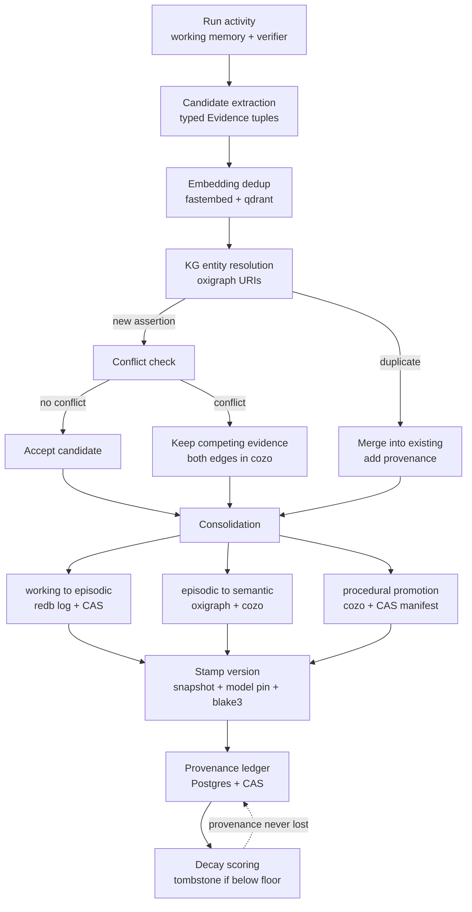
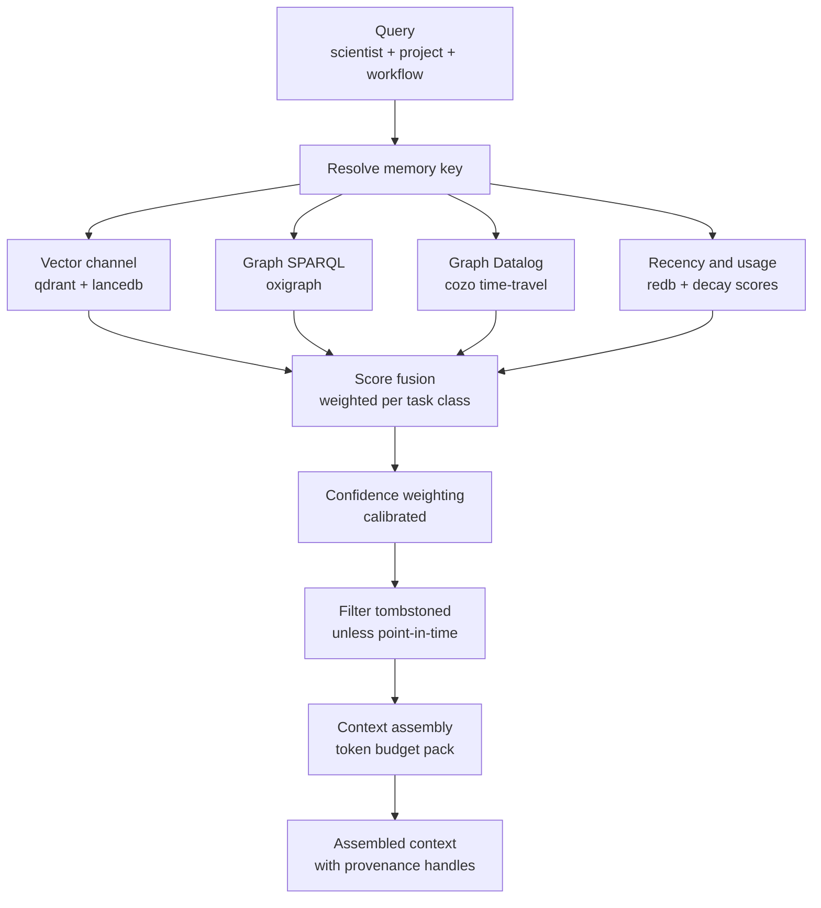
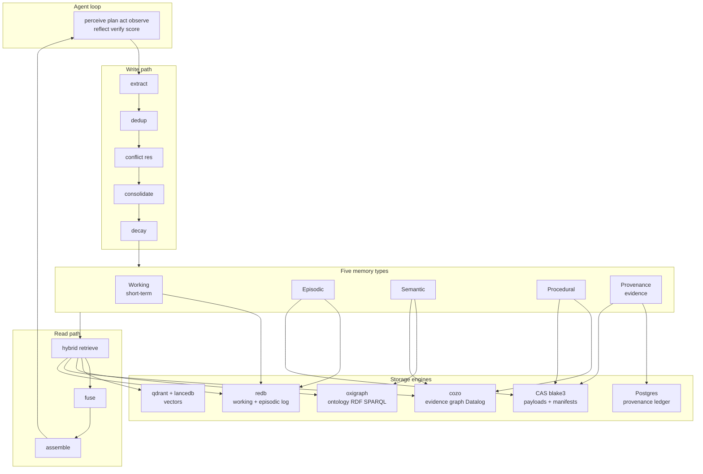

# 02 — Agent Memory Architecture

> Pillar 2 of Oncora. Persistent retention + context-aware decisions across multi-session
> oncology discovery workflows. This document expands the *Agent memory architecture* section
> of the design canon into the authoritative deep dive for the `oncora-memory` crate.
>
> Cross-references: [01-architecture.md](01-architecture.md) ·
> [03-uncertainty-reliability.md](03-uncertainty-reliability.md) ·
> [04-knowledge-and-data.md](04-knowledge-and-data.md) ·
> [05-tech-decisions.md](05-tech-decisions.md) · [07-repo-layout.md](07-repo-layout.md).

---

## 1. Motivation — why memory is a first-class subsystem

Oncology drug discovery is not a single chat turn. A scientist returns to the same target over
weeks: pulling literature on a kinase, layering in variant-level resistance data, cross-checking
against trial endpoints, abstaining where evidence is thin, and resuming later. The platform's
value collapses if every session starts cold. Memory is therefore a **named pillar**, not a
convenience cache.

What we are explicitly **not** building:

- **Not chat history.** Transcript replay is lossy and unstructured. It cannot answer "what do we
  currently believe about EGFR T790M resistance, and on what evidence" — it can only show what was
  said. Memory carries *typed claims with confidence and provenance*, not utterances.
- **Not a vanilla vector store.** A single embedding index gives fuzzy text recall with no notion
  of entity identity, contradiction, time-travel, or authority. It cannot say "this 2019 claim is
  superseded by a 2024 trial readout" or "these two assertions contradict and both are retained as
  competing evidence." It has no provenance ledger and no replay guarantee.

The differentiators that make this a subsystem rather than a library call:

| Property | Chat history | Vanilla vector store | Oncora memory |
|---|---|---|---|
| Typed, confidence-bearing claims | no | no | yes — see [03](03-uncertainty-reliability.md) |
| Entity identity / resolution | no | weak | yes — KG-grounded |
| Contradictions retained | no | no | yes — competing evidence |
| Point-in-time / time-travel | no | no | yes — `cozo` |
| Provenance on every item | no | partial | yes — Postgres ledger + CAS |
| Deterministic replay | no | no | yes — snapshot + model pin |
| Cross-session keying | per chat | per collection | `(scientist, project, workflow)` |

Memory is keyed cross-session by `(scientist, project, workflow)` and every entry is versioned,
attributed, and content-addressed so that a run is replayable. Those three guarantees are the
spine of this document.

---

## 2. The five memory types

Each type has a **purpose**, **contents**, **lifetime**, and **storage engine mapping** drawn
verbatim from the canon's LOCKED technology decisions.

### 2.1 Working / short-term

- **Purpose**: scratchpad for the current run — the agent loop's volatile state.
- **Contents**: current plan state, intermediate tool results, partial chains of reasoning,
  pending verification queue.
- **Lifetime**: bounded by the run; discarded or selectively consolidated at run end.
- **Storage**: in-memory structures with `redb` spill for large or crash-safe state.

### 2.2 Episodic

- **Purpose**: the append-only flight recorder of what actually happened.
- **Contents**: every step, MCP tool call, observation, decision, and `Verdict`
  (Accept / Abstain / Escalate) in temporal order.
- **Lifetime**: durable; effectively permanent (subject to retention policy), never mutated.
- **Storage**: `redb` log for the ordered event stream + CAS for large payloads (tool outputs,
  documents) referenced by BLAKE3 hash.

### 2.3 Semantic

- **Purpose**: durable, curated facts and relationships — the platform's belief state.
- **Contents**: canonical entities and edges per the KG schema in
  [04-knowledge-and-data.md](04-knowledge-and-data.md) — Target, Disease, Pathway, Compound,
  Variant, Trial, plus Claim/Evidence assertions with per-edge confidence.
- **Lifetime**: long-lived; updated via consolidation and conflict resolution, never silently
  overwritten.
- **Storage**: dual store — `oxigraph` (RDF/SPARQL) for ontology-grounded canonical entities
  (URIs from GO/Reactome/ChEMBL/UMLS/MONDO/HGNC) + `cozo` (Datalog, time-travel) for the
  evidence/assertion graph with per-edge confidence and provenance.

### 2.4 Procedural

- **Purpose**: learned how-to knowledge — what worked.
- **Contents**: successful plan templates, effective tool-use sequences, skill recipes, tuned
  retrieval strategies per task class.
- **Lifetime**: long-lived; reinforced by repeated success, decayed when superseded.
- **Storage**: `cozo` (pattern graph + relational) + CAS manifests for the serialized plan/skill
  bodies.

### 2.5 Provenance / evidence

- **Purpose**: the audit and reproducibility backbone — links every memory item to its origins.
- **Contents**: per the canonical `Provenance` type —
  `sources`, `tool_calls`, `model` pin, `snapshot` id — plus the support/contradiction structure
  of `Evidence`.
- **Lifetime**: permanent and immutable. Decay and tombstones may hide a fact, but **provenance is
  never lost**.
- **Storage**: Postgres provenance ledger (`sqlx`, compile-checked SQL, multi-node) + CAS for the
  content-addressed payloads.

| Type | Purpose | Lifetime | Primary engine | Secondary |
|---|---|---|---|---|
| Working | run scratchpad | run-scoped | in-mem | `redb` spill |
| Episodic | append-only history | durable, immutable | `redb` log | CAS payloads |
| Semantic | belief state / KG | long-lived | `oxigraph` + `cozo` | — |
| Procedural | learned patterns | long-lived | `cozo` | CAS manifests |
| Provenance | audit + replay | permanent, immutable | Postgres ledger | CAS |

> **Implemented.** `oncora-memory` ships `RedbMemoryStore` (pure-Rust embedded ACID KV) behind the same `MemoryStore` trait as `InMemoryMemoryStore`, under `--features redb` — durable, on-disk working/episodic memory. Both pass an identical conformance test (write/dedup/conflict-resolve → scoped read → tombstone on forget). It was exercised in the [real-world validation run](09-validation.md): memory writes averaged ~1.5 ms over 58 documents.

---

## 3. Write path deep dive

The write path converts raw run activity into durable, deduplicated, conflict-resolved,
provenance-bearing memory. It is a pipeline, owned by `oncora-memory`, invoked at the
*consolidate* step of the agent loop (see [01-architecture.md](01-architecture.md)).

### 3.1 Candidate extraction

The verifier/uncertainty stages emit `Evidence` items. Extraction lifts candidate facts —
`(claim, support, contradiction, confidence, provenance)` tuples — from working memory and the run
transcript. Candidates are typed against the KG schema; free-text-only candidates that cannot be
mapped to an entity type are held as episodic-only and not promoted to semantic.

### 3.2 Dedup — embedding + KG entity resolution

Two-stage dedup:

1. **Embedding near-duplicate detection.** Candidate claim text is embedded (`fastembed`, ONNX via
   `ort`) and checked against the vector index (`qdrant`; `lancedb` for multimodal). Above a
   cosine threshold the candidate is a *merge candidate*.
2. **KG entity resolution.** Subjects/objects are resolved to canonical URIs in `oxigraph`
   (HGNC/ChEMBL/MONDO etc.). Two claims about the *same resolved entities and predicate* are the
   same assertion even if worded differently. Entity resolution is the authoritative tie-breaker;
   embedding similarity only proposes.

### 3.3 Conflict resolution

When a resolved assertion already exists with a differing value, we do **not** overwrite. Policy
inputs: **recency**, **source authority**, and **calibrated confidence**. Contradictions are
**retained as competing evidence** — both edges live in `cozo` with their own confidence and
provenance, and the *current belief* is a computed view, not a destructive write. Full policy is
in [§7](#7-conflict-resolution-policy).

### 3.4 Consolidation — working → episodic → semantic

Promotion is staged, never skipped:

- **working → episodic**: every accepted step is appended to the `redb` episodic log with CAS
  payload refs. This is unconditional and immutable.
- **episodic → semantic**: only candidates that (a) resolve to KG entities, (b) survive dedup, and
  (c) clear the confidence/verdict bar are promoted into `oxigraph`/`cozo` as durable facts.
- **procedural promotion**: plans/tool sequences whose runs ended in `Accept` with high confidence
  are templatized into procedural memory.

### 3.5 Decay / forgetting

Forgetting is *visibility management*, not deletion. Each semantic/procedural entry carries a
**decay score** combining time-since-last-use and access frequency. Below a floor the entry is
**soft-deleted with a tombstone** and excluded from default retrieval. It can be revived if
re-observed. Episodic history and **provenance are never decayed or deleted** — they are the
replay substrate. `cozo` time-travel lets us reconstruct the belief state at any past instant
regardless of later decay.

### 3.6 Versioning, attribution, content-addressing (per write)

Every write records: a `SnapshotId` (data snapshot pin), a `ModelPin` (model/version that produced
it), and a BLAKE3 content hash of the payload stored in CAS. This is what makes a run replayable
(see [§6](#6-versioning-attribution-reproducibility)).

### 3.7 Write/consolidation flowchart



---

## 4. Read path deep dive

Retrieval is **hybrid**: no single index is authoritative. We fan out across vector, graph, and
recency/usage signals, fuse scores, then assemble context under a token budget.

### 4.1 Hybrid retrieval channels

- **Vector**: semantic similarity over claim/document embeddings — `qdrant` for text/RAG,
  `lancedb` for multimodal/imaging embeddings.
- **Graph — SPARQL**: `oxigraph` answers ontology-structured queries over canonical entities
  ("targets involved in this pathway with a known resistance variant").
- **Graph — Datalog**: `cozo` answers recursive/relational queries over the evidence graph and
  supports **point-in-time** queries — "what did we believe at snapshot X."
- **Recency / usage**: episodic `redb` and decay scores boost recently-used, frequently-confirmed
  memory.

### 4.2 Score fusion

Each channel returns scored candidates. Fusion produces a single relevance score combining
similarity, graph-path relevance, recency, usage, and the entry's **calibrated confidence** (low
confidence is down-weighted, not hidden). Fusion weights are configurable per task class and are
themselves a candidate for procedural-memory tuning.

### 4.3 Context assembly under token budget

Fused candidates are packed under the model's token budget: deduplicated, ordered by fused score,
truncated/summarized to fit, and each carried with its provenance handle so downstream claims stay
attributable. Competing evidence is surfaced *together* so the agent can reason about contradiction
rather than seeing one side.

### 4.4 Read/retrieval flowchart



---

## 5. Overall memory architecture

One picture: five memory types, write path, read path, storage-engine mapping.



---

## 6. Versioning, attribution, reproducibility

Reproducibility is a cross-cutting non-negotiable (canon §Cross-cutting). Memory enforces it at
the entry level:

- **Snapshot id** — every entry pins the data snapshot (`SnapshotId`) it was derived under. Replay
  rebinds to that snapshot so retrieval returns the same corpus state.
- **Model pin** — every entry records the `ModelPin` (model + version + decode config) that
  produced it, so the generating model is reconstructable.
- **Content-addressed payload** — the entry's payload is stored in CAS under its BLAKE3 hash; the
  entry holds the hash, not a mutable copy. Identical payloads dedup naturally and tampering is
  detectable.

Together these make a run **deterministically replayable**: given `(snapshot, model pin, content
hashes)`, the same inputs reproduce the same memory state and the same retrieval. `cozo`
time-travel adds point-in-time reconstruction of the *belief* state.

**Cross-session keying.** Memory is partitioned by `(scientist, project, workflow)`. The same
scientist resuming the same project's workflow sees their accumulated, decayed-and-consolidated
memory; a different project is isolated. This key is the retrieval scope and the provenance
attribution subject.

---

## 7. Conflict-resolution policy

Decision table. Inputs are recency, source authority, and calibrated confidence. The governing
principle: **never silently overwrite; contradictions are kept as competing evidence.**

| Situation | Rule | Rationale |
|---|---|---|
| New claim, no existing assertion | Insert as new semantic fact with provenance | Nothing to reconcile |
| New claim duplicates existing<br/>same entities + predicate + value | Merge; append source + tool call to provenance; bump usage | Reinforce, do not duplicate |
| New claim agrees, higher authority source | Keep both; mark higher-authority as current belief | Authority informs belief without erasing history |
| New claim contradicts, more recent + higher confidence | Retain both edges; current-belief view favors new | Recency + confidence drive the view, not deletion |
| New claim contradicts, lower confidence or weaker source | Retain both; current-belief view stays old; flag for review | Weak evidence cannot silently flip a belief |
| Contradiction with comparable authority + confidence | Retain both as competing evidence; surface together; abstain if asked | Honest uncertainty over false resolution — see [03](03-uncertainty-reliability.md) |
| Existing fact superseded by trial readout | Add new edge; time-stamp; old remains queryable via time-travel | Reproducibility of past conclusions |
| Entity resolution ambiguous | Do not merge; keep separate; queue for resolution | Avoid silent wrong merges |
| Entry below decay floor | Tombstone; exclude from default read; keep provenance | Forgetting is visibility, not loss |

---

## 8. Key Rust types (sketch)

Consistent with `oncora-core` (canonical types) and the `oncora-memory` crate boundary. Provider
swappability lives behind the `MemoryStore` trait per the canon's trait-boundary rule.

```rust
use oncora_core::{Confidence, Evidence, Provenance, SnapshotId, ModelPin};

/// Content-addressed identity of a memory payload (BLAKE3).
pub struct ContentHash(pub [u8; 32]);

/// Cross-session scope key: (scientist, project, workflow).
pub struct MemoryKey {
    pub scientist: ScientistId,
    pub project: ProjectId,
    pub workflow: WorkflowId,
}

/// Which of the five memory types an entry belongs to.
pub enum MemoryKind {
    Working,
    Episodic,
    Semantic,
    Procedural,
    Provenance,
}

/// One versioned, attributed, content-addressed memory entry.
pub struct MemoryEntry {
    pub id: MemoryId,
    pub key: MemoryKey,
    pub kind: MemoryKind,
    pub evidence: Evidence,            // claim + support/contradiction + confidence
    pub provenance: Provenance,        // sources + tool_calls + model + snapshot
    pub snapshot: SnapshotId,          // data snapshot pin (replay)
    pub model: ModelPin,               // generating model pin (replay)
    pub payload: ContentHash,          // CAS handle, BLAKE3
    pub decay_score: f64,              // time + usage; below floor => tombstone
    pub tombstoned: bool,
}

/// Retrieval request resolved under a memory key and token budget.
pub struct ReadQuery {
    pub key: MemoryKey,
    pub text: Option<String>,
    pub as_of: Option<SnapshotId>,     // point-in-time via cozo time-travel
    pub token_budget: usize,
}

/// Provider-swappable store boundary (impls: redb/cozo/oxigraph/qdrant/Postgres).
#[async_trait::async_trait]
pub trait MemoryStore {
    type Error;

    /// Write path: extract -> dedup -> conflict res -> consolidate -> decay.
    async fn write(&self, entry: MemoryEntry) -> Result<MemoryId, Self::Error>;

    /// Read path: hybrid retrieve -> fuse -> assemble under budget.
    async fn read(&self, query: ReadQuery) -> Result<Vec<MemoryEntry>, Self::Error>;

    /// Soft-delete with tombstone; provenance is retained.
    async fn forget(&self, id: MemoryId) -> Result<(), Self::Error>;
}
```

---

## 9. Risks & open questions

- **Decay tuning.** The time/usage decay function and floor are heuristics. Too aggressive and we
  forget useful rare facts; too lax and growth is unbounded. Needs empirical calibration per task
  class and likely procedural-memory feedback — open.
- **Entity-resolution errors.** Wrong merges silently corrupt the semantic graph (false identity);
  missed merges fragment belief. Mitigated by KG-authoritative resolution and an
  ambiguous-resolution queue, but precision/recall trade-off is unresolved.
- **Unbounded growth.** Episodic + provenance are immutable and never decayed by design. CAS dedup
  helps, but long-lived projects will grow without bound; retention tiers / cold storage for old
  episodic data are an open operational question (relates to `foundationdb` scale-out, canon).
- **Fusion weighting.** Per-task-class fusion weights are configurable but currently hand-set;
  learning them risks overfitting and feedback loops with procedural memory.
- **Confidence drift.** Calibrated confidence ([03](03-uncertainty-reliability.md)) is pinned at
  write time; recalibration of the underlying model can make stored confidences stale. Whether to
  re-score historical memory or version the calibrator is open.
- **Privacy at decay.** Tombstoning hides but never deletes; provenance retention vs. PHI deletion
  obligations may conflict and needs a policy decision within the trust boundary.
