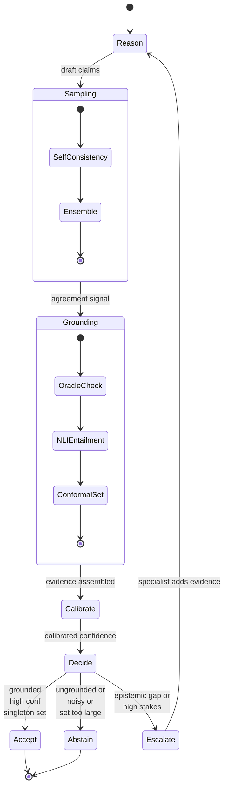
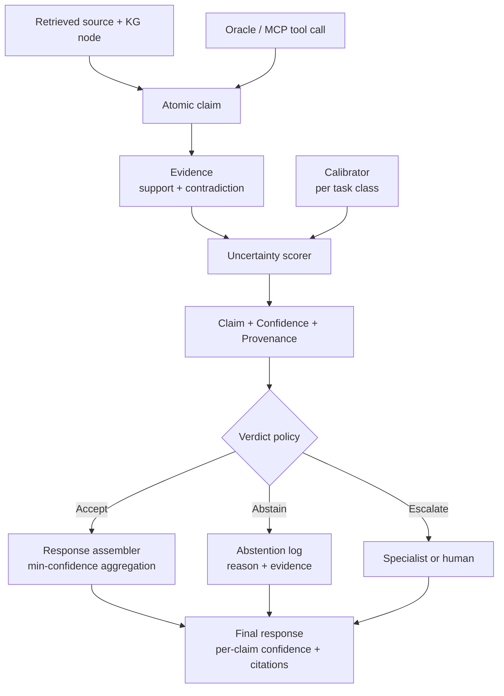

# 03 — Robustness & Uncertainty / Reliability

> Pillar 3 of Oncora: **Robustness & uncertainty** — typed calibrated confidence; abstain or escalate over confabulate.
> Authoritative decisions live in the internal design canon. This document is the spec for the `oncora-uncertainty` crate and its contract with `oncora-agents`, `oncora-core`, and `oncora-eval`.

Related: [00 overview](00-overview.md) · [01 architecture](01-architecture.md) · [02 memory](02-memory.md) · [04 knowledge-and-data](04-knowledge-and-data.md) · [05 tech-decisions](05-tech-decisions.md) · [06 eval-benchmarking](06-eval-benchmarking.md) · [07 repo-layout](07-repo-layout.md)

---

## 1. Thesis

In oncology drug discovery a confident wrong answer is worse than no answer. A fabricated resistance mechanism, a miscited trial endpoint, or an invented dosing calculation can derail a program or harm a patient. Oncora therefore treats **uncertainty as a typed, first-class value** that is produced, propagated, and acted upon — not a soft afterthought bolted onto a logit.

Three commitments follow, and they are non-negotiable:

1. **Every claim carries confidence and provenance.** A bare assertion with no `Confidence` and no `Provenance` is a type error in the pipeline, not a stylistic lapse. Claims without grounding never reach the responder.
2. **The system can decline.** The terminal act of reasoning is a `Verdict`, and `Abstain` and `Escalate` are first-class outcomes ranked above a low-confidence `Accept`. The platform would rather say "I do not know — escalating to a human reviewer" than confabulate.
3. **Confidence is calibrated, not vibes.** A reported `Confidence(0.9)` must mean the claim is right roughly 90% of the time on held-out data. Calibration is measured (ECE), enforced (post-hoc calibrators), and re-checked on a cadence.

This pillar is what lets Oncora make the reliability claims in [06 eval-benchmarking](06-eval-benchmarking.md): not just "more accurate," but **knows when it is likely wrong** and acts accordingly.

---

## 2. Typed confidence model

The canonical types live in `oncora-core` so that every crate speaks the same language. `oncora-uncertainty` consumes and produces them; `oncora-agents` routes on them; `oncora-eval` measures them.

```rust
// oncora-core::uncertainty

use serde::{Deserialize, Serialize};

/// Calibrated probability in [0,1]. Construction is fallible so an
/// out-of-range value can never silently propagate.
#[derive(Copy, Clone, Debug, PartialEq, Serialize, Deserialize)]
pub struct Confidence(f64);

impl Confidence {
    pub fn new(p: f64) -> Result<Self, UncertaintyError> {
        if (0.0..=1.0).contains(&p) {
            Ok(Self(p))
        } else {
            Err(UncertaintyError::OutOfRange(p))
        }
    }
    pub fn get(self) -> f64 { self.0 }
}

/// How a Confidence was post-hoc calibrated. Travels with the value so
/// downstream consumers know what they are trusting.
#[derive(Copy, Clone, Debug, PartialEq, Serialize, Deserialize)]
pub enum CalibrationMethod {
    Raw,              // uncalibrated model score — not allowed past the scorer
    TemperatureScaled,
    Isotonic,
    Conformal,        // confidence implied by a calibrated prediction set
}

/// Where a claim's support came from. Reproducibility hinges on this:
/// every field is enough to replay the decision.
#[derive(Clone, Debug, Serialize, Deserialize)]
pub struct Provenance {
    pub sources: Vec<SourceRef>,     // retrieved docs / KG nodes / datasets
    pub tool_calls: Vec<ToolCallId>, // deterministic, audited MCP calls
    pub model: ModelPin,             // pinned weights + decoding params
    pub snapshot: SnapshotId,        // content-addressed data snapshot (BLAKE3)
}

/// Directional evidence for or against a claim.
#[derive(Clone, Debug, Serialize, Deserialize)]
pub struct Evidence {
    pub claim: ClaimId,
    pub support: Vec<EvidenceItem>,       // entailing sources / agreeing oracles
    pub contradiction: Vec<EvidenceItem>, // refuting sources / disagreeing oracles
    pub confidence: Confidence,
    pub method: CalibrationMethod,
    pub provenance: Provenance,
}

/// A single piece of evidence with a per-item NLI / agreement strength.
#[derive(Clone, Debug, Serialize, Deserialize)]
pub struct EvidenceItem {
    pub source: SourceRef,
    pub strength: f64,        // e.g. NLI entailment prob, or oracle agreement
    pub relation: Relation,   // Entails | Contradicts | Neutral
}

/// Decomposed uncertainty so the policy can act on *why* we are unsure.
#[derive(Copy, Clone, Debug, Default, Serialize, Deserialize)]
pub struct UncertaintySources {
    pub aleatoric: f64,  // irreducible data noise (assay variance, label noise)
    pub epistemic: f64,  // model / knowledge gaps (reducible with more evidence)
    pub retrieval: f64,  // corpus / KG coverage gaps
    pub tool: f64,       // oracle disagreement / calculator domain errors
}

/// Terminal outcome of reasoning over a claim. Abstain/Escalate are
/// first-class, not failure modes.
#[derive(Clone, Debug, Serialize, Deserialize)]
pub enum Verdict {
    Accept { confidence: Confidence },
    Abstain { reason: AbstainReason },
    Escalate { to: EscalationTarget, reason: String },
}

#[derive(Copy, Clone, Debug, Serialize, Deserialize)]
pub enum EscalationTarget { HumanReviewer, SpecialistAgent }

#[derive(Clone, Debug, Serialize, Deserialize)]
pub enum AbstainReason {
    LowCalibratedConfidence { conf: f64, threshold: f64 },
    ConformalSetTooLarge { size: usize, max: usize },
    OracleDisagreement { detail: String },
    UngroundedClaim,          // no entailing source for an asserted fact
    InsufficientRetrieval,    // retrieval coverage below floor
}
```

Design notes:

- `Confidence::new` is fallible by construction; there is no `From<f64>`. An out-of-range probability is a bug we want to surface, not absorb.
- `CalibrationMethod::Raw` is representable but **rejected by the scorer** — the uncertainty scorer refuses to emit an `Accept` whose confidence is still `Raw`. This is enforced in code, not by convention.
- `UncertaintySources` is a decomposition, not a single scalar, because the **policy routes differently** on the source: high *epistemic* uncertainty escalates to a specialist (more evidence may help); high *aleatoric* uncertainty often abstains (more evidence will not help).
- `Provenance` is exactly the canon definition and is the same struct used by [02 memory](02-memory.md) on every memory write — uncertainty and memory share one provenance type.

---

## 3. Where uncertainty comes from

Each `UncertaintySources` field is estimated by a distinct mechanism. The scorer fuses them.

| Source | What it captures | How it is estimated |
|---|---|---|
| **Aleatoric** | Irreducible noise in the underlying data | Variance baked into the data snapshot — assay error bars, label disagreement in golden sets, reported CIs on trial endpoints. Propagated from `oncora-ingest` as metadata on `SourceRef`. |
| **Epistemic** | Model / knowledge gaps | Spread across self-consistency samples and across the ensemble. Wide disagreement among samples that all draw on the same evidence implies the model is guessing. |
| **Retrieval** | Corpus / KG coverage gaps | Retrieval-side signals from `oncora-retrieval`: top-k similarity floor, number of distinct corroborating sources, KG node degree for the entity, and whether any retrieved source actually entails the claim. |
| **Tool** | Oracle disagreement / out-of-domain calculators | Disagreement between the LLM-proposed answer and deterministic oracles<br/>+ calculators flagging inputs outside their validated domain. |

The decomposition is what makes the abstention policy explainable: an abstention log says *"abstained: retrieval=0.7 — only 1 corroborating source, KG entity degree 0"* rather than an opaque "low confidence."

---

## 4. Methods

These are the estimators `oncora-uncertainty` runs. They are deliberately layered: cheap signals first, expensive grounding only when cheaper signals are inconclusive.

### 4.1 Self-consistency (N samples)

Sample the same prompt N times at temperature > 0 against the same `ModelPin`, then measure agreement on the extracted answer.

- **Signal:** the fraction agreeing on the modal answer maps to an epistemic estimate; entropy over distinct answers is the raw uncertainty.
- **Implementation:** `oncora-agents` issues N concurrent generations via the `ModelProvider` trait (backed by `async-openai` → on-prem vLLM/TGI, or `mistral.rs` local). Answer extraction + clustering lives in `oncora-uncertainty::self_consistency`. Concurrency is semaphore-limited per the runtime rules in [01 architecture](01-architecture.md).
- **Cost control:** N is per-task-class config; trivial lookups use N=1, high-stakes claims use N=5–9.

### 4.2 Ensembles (multi-model / multi-prompt)

Run the claim through structurally different reasoners — different models (e.g. a local `mistral.rs` model + an on-prem vLLM-served model) and/or different prompt framings — and measure cross-reasoner agreement.

- **Signal:** correlated errors are rarer across genuinely different models, so ensemble disagreement is a stronger epistemic signal than self-consistency alone.
- **Implementation:** `oncora-uncertainty::ensemble` dispatches over a `Vec<Box<dyn ModelProvider>>` and a prompt-variant set; agreement is computed with the same answer-clustering used by self-consistency.

### 4.3 Deterministic oracle grounding

The differentiator. Wherever a claim can be checked by something **exact**, we check it and treat the oracle as ground truth.

- **Oracles:** clinical calculators (dose adjustment, BSA, creatinine clearance, response criteria) and the **knowledge graph** (`oxigraph` ontology facts + `cozo` evidence graph) per [04 knowledge-and-data](04-knowledge-and-data.md).
- **Mechanism:** oracles are exposed as **MCP tools** via `rmcp` through `oncora-mcp-host`. Tool calls are deterministic and audited (recorded to episodic memory + the provenance ledger). The scorer compares the LLM answer to the oracle answer; a mismatch drives `UncertaintySources.tool` toward 1.0 and can force `Abstain { OracleDisagreement }` regardless of how confident the model sounded.
- **Why it matters:** a calculator does not hallucinate. Grounding the verifiable subset of every answer in deterministic computation collapses a large class of confabulations to zero.

### 4.4 Conformal prediction

For classification-style claims (e.g. "which resistance class," "responder vs non-responder," candidate target ranking) Oncora emits **set-valued outputs with a distribution-free coverage guarantee**.

- **Guarantee:** given a calibration set and a target error rate α, split-conformal prediction yields a prediction set that contains the true label with probability ≥ 1−α — **without assuming the model is calibrated or the data is Gaussian**, requiring only exchangeability of calibration and test data.
- **Abstention link:** set **size** is the abstention signal. A singleton set is a confident answer; a large set means "the data does not separate these options" → abstain or escalate. This is more honest than thresholding a softmax.
- **Implementation:** `oncora-uncertainty::conformal` computes nonconformity scores on a held-out calibration split (sourced from the [06 eval-benchmarking](06-eval-benchmarking.md) harness), derives the quantile threshold, and constructs sets at inference. Pure Rust; no external solver. Underlying classifier scores come from ONNX models run via `ort` (the canon fallback for local inference is `ort`, used here for classifiers/calibrators) or from the model's own answer distribution.

### 4.5 ECE — calibration measurement

**Expected Calibration Error** is the metric for "does `Confidence(0.9)` mean 90%."

- **Computation:** bin predictions by confidence, compare per-bin mean confidence to per-bin empirical accuracy, weight by bin population. `oncora-uncertainty::ece` computes both ECE and reliability-diagram data.
- **Role:** ECE is a **gate**, not just a dashboard number. [06 eval-benchmarking](06-eval-benchmarking.md) fails CI if post-calibration ECE on the golden set exceeds the per-task-class budget. ECE also triggers recalibration (§7).

### 4.6 Citation-grounding / NLI entailment

To catch hallucination in *generative* claims, every asserted fact must be **entailed by a retrieved source**.

- **Mechanism:** for each atomic claim, run a Natural Language Inference model (claim vs each retrieved passage). Entailment → support; contradiction → recorded in `Evidence.contradiction`; all-neutral → the claim is **ungrounded** → `Abstain { UngroundedClaim }`.
- **Implementation:** the NLI model is an ONNX cross-encoder served through `ort` behind the `Verifier` trait. Entailment probabilities populate `EvidenceItem.strength`. This is what turns "the model said it" into "a pinned source supports it."

---

## 5. Verifier agents

Verifiers sit between the domain specialists and the uncertainty scorer in the canonical topology:

**Planner → Domain Specialists → Verifier → Uncertainty Scorer → Responder.**

Verifiers do **not** generate answers; they adjudicate the specialists' claims. Each implements the `Verifier` trait (`oncora-core`), and `oncora-agents` runs the relevant set per claim.

| Verifier | Checks | Output into the scorer |
|---|---|---|
| **Citation verifier** | Every atomic claim is entailed by ≥1 retrieved, pinned source (NLI, §4.6) | `EvidenceItem`s with entailment strengths; flags ungrounded claims |
| **Oracle verifier** | LLM answer matches deterministic calculator / KG result (§4.3) | Agreement bit + magnitude → `UncertaintySources.tool` |
| **Consistency verifier** | Self-consistency + ensemble agreement (§4.1–4.2) | Agreement fraction / answer entropy → epistemic |
| **Contradiction verifier** | Claim does not contradict high-authority KG facts or prior accepted evidence in memory | Contradiction list → can force abstain |
| **Schema / unit verifier** | Numeric claims carry units; values within plausible physiological ranges | Hard reject of malformed claims before scoring |

The **uncertainty scorer** is the single point that fuses verifier outputs into the typed model: it assembles `Evidence`, decomposes `UncertaintySources`, applies the calibrator (§6) to produce a final `Confidence` + `CalibrationMethod`, and hands the policy (§8) what it needs to choose a `Verdict`. The scorer is the only component allowed to emit `Accept`.

---

## 6. Calibration

Raw model scores are systematically overconfident. Oncora applies **post-hoc calibration** behind a trait so the method is swappable per task class.

```rust
// oncora-core::traits

pub trait Calibrator: Send + Sync {
    /// Fit on held-out (raw_score, correct?) pairs from the eval harness.
    fn fit(&mut self, samples: &[CalibrationSample]) -> Result<(), UncertaintyError>;

    /// Map a raw model score to a calibrated Confidence.
    fn calibrate(&self, raw: f64) -> Confidence;

    fn method(&self) -> CalibrationMethod;
}
```

- **Temperature scaling** (`CalibrationMethod::TemperatureScaled`): single-parameter logit scaling; cheap, preserves ranking, good default for well-behaved classifiers.
- **Isotonic regression** (`CalibrationMethod::Isotonic`): non-parametric monotone fit; used when reliability curves are non-sigmoid. More flexible, needs more calibration data.
- **Conformal** (`CalibrationMethod::Conformal`): the set-based route of §4.4 when set-valued output is appropriate.

**Where calibration data comes from:** the [06 eval-benchmarking](06-eval-benchmarking.md) harness owns the golden/calibration splits. `oncora-eval` produces `CalibrationSample`s of `(raw_score, was_correct, task_class, snapshot)`; `oncora-uncertainty` fits per-task-class calibrators on those. Calibrators are content-addressed artifacts (BLAKE3) tied to a `ModelPin` + `SnapshotId`, so a calibrated confidence is reproducible.

**Recalibration cadence:**
- On any `ModelPin` change (new weights / decoding params) — mandatory before promotion.
- On any data `SnapshotId` change affecting a task class.
- On scheduled monitoring when measured ECE on rolling production-shadow evals exceeds the task-class budget (drift).
- Quarterly minimum even if nothing has tripped, to catch slow distribution shift.

---

## 7. Abstention / escalation policy

The policy is a pure function of typed inputs and is **configurable per task class** (a "literature summary" tolerates more than a "dose recommendation"). Every non-Accept verdict is logged with its reason to episodic memory + the provenance ledger.

Inputs: calibrated `Confidence`, conformal set size, oracle agreement, retrieval coverage, NLI grounding, and the `UncertaintySources` decomposition.

### Decision table

| Condition | Verdict | Action |
|---|---|---|
| Oracle disagreement on a verifiable sub-claim | `Abstain` / `Escalate` | Trust the oracle; never override a calculator/KG with prose. Escalate to specialist if recoverable. |
| Claim has no entailing source<br/>NLI all-neutral | `Abstain { UngroundedClaim }` | Drop the claim or escalate to retrieve more; never assert ungrounded. |
| Conformal set size > task-class max | `Abstain { ConformalSetTooLarge }` | Data does not separate the options; return the set, do not pick. |
| Calibrated confidence ≥ accept-threshold AND grounded AND oracle-agree AND set is singleton | `Accept` | Emit claim with `Confidence` + `Provenance`. |
| Confidence in escalate-band AND epistemic-dominant | `Escalate { SpecialistAgent }` | More targeted evidence may resolve it; route to domain specialist. |
| Confidence below abstain-floor AND aleatoric-dominant | `Abstain { LowCalibratedConfidence }` | Irreducible noise; more work will not help. |
| Confidence below abstain-floor AND high-stakes task class | `Escalate { HumanReviewer }` | Defer to a human; log full evidence bundle. |
| Retrieval coverage below floor | `Abstain { InsufficientRetrieval }` | Corpus/KG gap; flag for ingestion backfill. |

Thresholds (`accept`, `escalate-band`, `abstain-floor`, `conformal-max`, `retrieval-floor`) are `figment`/`config`-layered values keyed by task class and validated at load. Defaults are conservative; high-stakes classes bias toward escalation.

---

## 8. The uncertainty & verification loop



The `Escalate → Reason` edge to a specialist is bounded by the per-run `CancellationToken` and a max-iteration cap; it is not an open loop.

## 9. Confidence + Provenance propagation

Confidence and provenance attach at claim creation and ride the claim all the way to the response. Aggregation is conservative: a response is only as confident as its weakest load-bearing claim.



Every accepted claim in the final response renders with its `Confidence` and a citation trail back to `SourceRef`s and `ToolCallId`s. Abstained/escalated claims are surfaced explicitly — the user always sees what the system declined to assert and why.

---

## 10. Reliability engineering

How this pillar makes agents reliable, and how it ties to benchmarking:

- **No silent confabulation.** Ungrounded or oracle-contradicted claims cannot reach the user as `Accept`. The most damaging failure mode in a clinical-adjacent system is structurally removed.
- **Calibrated trust.** A downstream scientist (or another agent's memory write) can rationally threshold on `Confidence` because it is calibrated and ECE-gated. Trust is quantified, not assumed.
- **Distribution-free guarantees where it counts.** Conformal sets give a coverage guarantee that holds without distributional assumptions — robust under the messy, shifting data of drug discovery.
- **Deterministic auditability.** Every verdict, oracle call, and abstention is recorded with `Provenance` to episodic memory + the provenance ledger, and is replayable from pinned models + content-addressed snapshots. A reviewer can reconstruct exactly why the system said what it said.
- **Reproducible reliability claims.** Because calibrators, golden sets, and snapshots are content-addressed and pinned, the reliability numbers are reproducible enough to publish — the explicit bar in pillar 4.

**Tie to [06 eval-benchmarking](06-eval-benchmarking.md):** `oncora-eval` is both the **source of calibration data** and the **enforcement point**. It owns golden/calibration splits, computes ECE, conformal coverage, abstention precision/recall, and *selective accuracy* (accuracy on the non-abstained subset). CI gates on: post-calibration ECE ≤ budget, conformal empirical coverage ≥ 1−α, and selective accuracy ≥ baseline. A regression in any of these blocks promotion. Reliability is thus a tested, gated property — not a claim.

---

## 11. Risks & what to verify

- **Conformal exchangeability assumption.** The coverage guarantee assumes calibration and test data are exchangeable. Under temporal drift (new trials, new assays) this can break. *Verify:* monitor empirical coverage on rolling shadow evals; consider Mondrian/group-conditional conformal per task class; re-split on snapshot change.
- **Calibration drift.** A calibrator fit on one snapshot/model degrades silently as inputs shift. *Verify:* continuous ECE monitoring with alerting; mandatory recalibration on any `ModelPin`/`SnapshotId` change; quarterly floor.
- **Oracle coverage gaps.** Deterministic grounding only protects the verifiable subset of a claim; the prose around it is still model-generated. *Verify:* track the fraction of each answer that is oracle-checkable; expand calculators/KG coverage where the unchecked fraction is high; never let oracle silence be read as oracle agreement.
- **NLI verifier blind spots.** The entailment model can miss subtle contradictions or accept superficially-matching but wrong passages. *Verify:* adversarial NLI test set in `oncora-eval`; ensemble NLI models; keep contradictions as competing evidence rather than discarding.
- **Self-consistency false confidence.** A model can be confidently and consistently wrong (correlated errors). *Verify:* prefer multi-*model* ensembles over multi-sample for high-stakes classes; treat self-consistency as a weak signal, oracle grounding as strong.
- **Threshold miscalibration per task class.** Wrong thresholds either over-abstain (useless) or under-abstain (unsafe). *Verify:* sweep thresholds on golden sets to target an explicit selective-risk operating point; review per task class.
- **Aggregation hiding weak links.** Min-confidence aggregation is conservative but can be gamed by decomposing a weak claim into many trivial true ones. *Verify:* aggregate over *load-bearing* claims identified by the planner, not all atomic claims.
