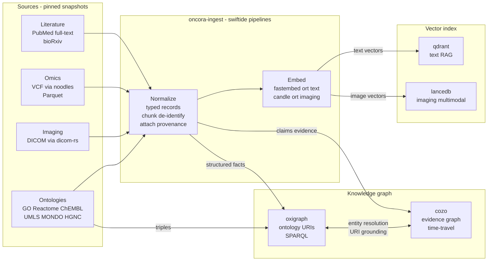
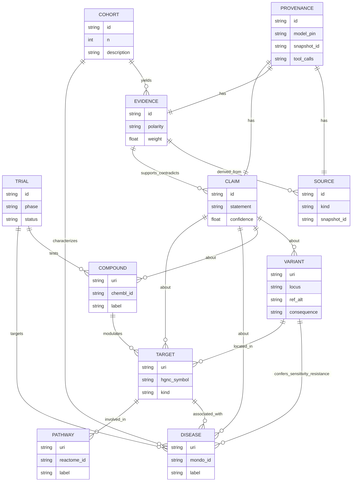
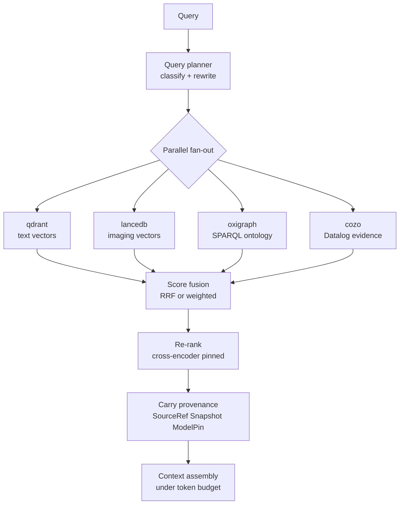

# Knowledge & Data — Multimodal Ingestion, Stores, and Hybrid Retrieval

This document specifies how Oncora turns four heterogeneous oncology modalities — literature, multi-omics, biomolecular knowledge, and clinical imaging — into a single queryable evidence substrate, and how that substrate is retrieved at reasoning time. It is the data-layer counterpart to [01-architecture.md](01-architecture.md), feeds the memory machinery in [02-memory.md](02-memory.md), and carries the provenance and snapshot guarantees that [03-uncertainty-reliability.md](03-uncertainty-reliability.md) depends on. Technology choices are locked in [05-tech-decisions.md](05-tech-decisions.md); crate boundaries are in [07-repo-layout.md](07-repo-layout.md).

The governing principle: **Oncora reads snapshots and never writes back to source data.** Every artifact it produces is content-addressed, every claim carries provenance back to a pinned snapshot and a pinned model, and ingestion is a deterministic, replayable function of (snapshot, pinned models, pipeline version).

---

## 1. The knowledge layer in one paragraph

Raw sources are pulled into **content-addressed snapshots** (BLAKE3, immutable). The `oncora-ingest` crate runs modality-specific [`swiftide`](05-tech-decisions.md) pipelines that **normalize** each source into typed Oncora records, **embed** what is embeddable (text, image/feature vectors) with pinned on-prem models, **index** vectors into `qdrant` (text/RAG) and `lancedb` (multimodal/imaging), and **graph** structured facts into the dual knowledge graph: `oxigraph` for ontology-grounded canonical entities with stable URIs, and `cozo` for the time-travelling evidence/assertion graph. Omics and imaging stay behind in-house MCP servers (`noodles` for genomics, `dicom-rs` for DICOM) and are queried analytically with `polars`/`duckdb` over Parquet. Retrieval is **hybrid**: vector search and graph traversal fan out in parallel, scores are fused, results are re-ranked, and provenance is carried through to the answer.

---

## 2. Per-modality ingestion

Every modality follows the same five-stage contract — **source → normalize → embed → index → graph** — but the work inside each stage differs. The pipeline contract is ours (`oncora-ingest`); `swiftide` is the streaming engine underneath, and we own the trait boundary regardless of it.

### 2.1 Literature

| Stage | What happens |
|---|---|
| Source | PubMed abstracts + open full-text snapshots, bioRxiv/medRxiv preprints, internal reports. Pulled into an immutable corpus snapshot with per-document BLAKE3 IDs and source metadata. |
| Normalize | Strip markup; segment into sections; **semantic chunking** with section-aware boundaries and overlap; attach `SourceRef` to every chunk. Sentence-level claim candidates extracted for the evidence graph. |
| Embed | Text chunks embedded on-prem via `fastembed` over `ort` (ONNX). Model + dimension pinned. |
| Index | Chunk vectors + payload metadata into `qdrant` (HNSW, payload filtering, quantization). |
| Graph | Extracted claims → `cozo` evidence graph as `Claim`/`Evidence` nodes with `derived_from → Source` edges; recognized entities (genes, diseases, compounds) **resolved** against `oxigraph` canonical URIs. |

Literature is the only modality where the *text itself* is the primary retrievable; for the rest, text is secondary to structure.

### 2.2 Omics

| Stage | What happens |
|---|---|
| Source | Variant calls as **VCF/BCF** served by the in-house VCF MCP server (built on `noodles`); bulk tabular omics (expression, mutation matrices, CNV) as **Parquet** snapshots. PHI/IP never leaves the trust boundary. |
| Normalize | VCF parsed to typed `Variant` records (locus, ref/alt, consequence, gene); tabular omics validated against expected schema; units and identifiers normalized to HGNC gene symbols and canonical loci. |
| Embed | Omics is mostly **not** embedded — it is queried analytically. Optional: derived signatures (e.g. mutational profiles) may get feature embeddings into `lancedb` for similarity search across cohorts. |
| Index | Tabular omics queried in place with `polars` (in-proc dataframes) and `duckdb` (SQL over Parquet); no separate vector index for raw matrices. |
| Graph | `Variant` entities into the KG: `located_in → Target`, `confers → sensitivity/resistance`. Canonical variant + gene URIs in `oxigraph`; cohort-level assertions and confidences in `cozo`. |

Omics analytics run **behind MCP tool boundaries** — agents never touch raw files; they call typed tools that return typed records with provenance.

### 2.3 Imaging

| Stage | What happens |
|---|---|
| Source | **DICOM** studies/series behind the imaging MCP server (built on `dicom-rs`). Pixel data and PHI stay on-prem; only de-identified features and embeddings move into the index. |
| Normalize | DICOM parsed to typed study/series/instance records; spacing/orientation normalized; de-identification enforced at the MCP boundary; clinically relevant tags retained as metadata. |
| Embed | Image and derived-feature embeddings produced on-prem via `candle`-hosted vision models or `ort`. Pinned model + dimension. |
| Index | Image/feature vectors + rich metadata into `lancedb` (columnar, multimodal, versioned). LanceDB is chosen here precisely because imaging vectors travel with heavy structured metadata. |
| Graph | Imaging-derived findings become `Evidence` linked to `Claim`/`Cohort`/`Disease` in `cozo`; canonical anatomy/finding terms resolved to ontology URIs in `oxigraph` where available. |

### 2.4 Biomolecular knowledge (ontologies)

| Stage | What happens |
|---|---|
| Source | **GO, Reactome, ChEMBL, UMLS, MONDO, HGNC** distributed as RDF / convertible to RDF. Each release pinned as a versioned snapshot. |
| Normalize | Mapped to a common RDF model; cross-references reconciled (e.g. HGNC ↔ gene URIs, MONDO ↔ disease URIs). |
| Embed | Not embedded — this is the canonical symbolic layer. Entity *labels/synonyms* may be embedded into `qdrant`/`lancedb` to power entity **resolution** during other pipelines. |
| Index | Loaded as triples into **`oxigraph`**, queryable by **SPARQL**. |
| Graph | This *is* the ontology layer of the KG: `Target`, `Disease`, `Pathway`, `Compound` canonical entities with stable URIs and the edges `involved_in`, `associated_with`, `modulates`. |

This layer is the **ground truth for identity**: every entity mentioned anywhere else is resolved to a URI here, which is what makes cross-modal joins possible at all.

---

## 3. Multimodal ingestion pipeline

All four pipelines share the source → normalize → embed → index → graph shape, run as `swiftide` streaming jobs under `oncora-ingest`, and fan into the two vector stores and the two graph stores. Provenance and snapshot IDs are attached at the source stage and carried through every downstream record.

Note the `oxigraph ↔ cozo` link: when `oncora-ingest` writes an assertion into the evidence graph, it resolves the entities it mentions to canonical ontology URIs first, so the evidence graph references the same identities as the symbolic layer.

---

## 4. Embedding strategy

Embeddings are **on-prem, pinned, and versioned**. No embedding model is called over the network by default; each is loaded locally via `ort` (ONNX) or `candle`, and its identity is part of the snapshot manifest so that a re-index is bit-stable.

| Modality | Engine | Model class | Dim (target) | Stored in |
|---|---|---|---|---|
| Literature / text | `fastembed` over `ort` | Biomedical/general sentence embedder | 768 | `qdrant` |
| Entity labels / synonyms | `fastembed` over `ort` | Same text embedder | 768 | `qdrant` (resolution index) |
| Imaging | `candle` or `ort` | Vision/feature encoder | 512–1024 | `lancedb` |
| Omics-derived signatures | `candle` or `ort` | Tabular/profile encoder | task-specific | `lancedb` |

Rules of the road:

- **Pinning.** Each embedding model is referenced by a `ModelPin` (name + revision + checksum). `fastembed` pulls ONNX weights — these are downloaded once, content-addressed, and frozen. A change of model is a new pin and forces a re-index, never a silent in-place mix.
- **Dimension discipline.** A collection's dimension is fixed at creation. Mixing dimensions or models inside one collection is forbidden; cross-model comparison happens through re-embedding, not vector arithmetic.
- **Co-location with metadata.** Vectors never travel alone — every vector carries `SourceRef`, `SnapshotId`, and the `ModelPin` used to produce it, so retrieval can reconstruct provenance and detect stale vectors after a re-pin.
- **Trait boundary.** All of this sits behind the `EmbeddingProvider` trait in `oncora-core`; `fastembed`/`candle`/`ort` are concrete impls and swappable without touching callers.

This is the same embedding substrate that semantic memory uses ([02-memory.md](02-memory.md)) — there is one embedding layer, not one per subsystem.

---

## 5. Knowledge graph design — the dual store

Oncora runs **two** graph stores on purpose. They answer different questions and have different correctness models, and conflating them would force one set of compromises onto both.

### 5.1 `oxigraph` — the ontology / canonical-entity layer

- Holds **ontology-grounded canonical entities** with stable **URIs** sourced from GO, Reactome, ChEMBL, UMLS, MONDO, HGNC.
- Standards-based **RDF triplestore**, queried with **SPARQL**.
- This is the **identity authority**: "what *is* EGFR", "which pathways is it `involved_in`", "what is the canonical URI for this disease". Facts here are curated, slow-moving, and treated as ground truth for identity and ontology structure.
- Pure-Rust, ships cleanly on-prem, and SPARQL is the natural query language for bio-ontologies.

### 5.2 `cozo` — the evidence / assertion graph

- Holds the **evidence/assertion graph**: `Claim`s, the `Evidence` for and against them, and the relationships Oncora *derives* rather than *imports*.
- Queried with **Datalog**; supports **time-travel** (point-in-time queries), **per-edge confidence**, and **per-edge provenance**.
- This is where contradiction lives: competing evidence is kept side by side with confidences, never silently overwritten (consistent with the memory conflict-resolution policy in [02-memory.md](02-memory.md)).
- Time-travel is the differentiator: "what did we believe about this target *as of* last quarter's snapshot" is a first-class query, which is exactly what reproducible reasoning and audit need.

### 5.3 Which store a query hits

| Query intent | Store | Language |
|---|---|---|
| Resolve a name/symbol to a canonical entity URI | `oxigraph` | SPARQL |
| Ontology structure — pathways, gene→pathway, disease hierarchy | `oxigraph` | SPARQL |
| Compound→target modulation from curated sources | `oxigraph` | SPARQL |
| What do we *claim*, and what evidence supports/contradicts it | `cozo` | Datalog |
| Per-edge confidence + provenance of an assertion | `cozo` | Datalog |
| Point-in-time / "as of snapshot X" beliefs | `cozo` | Datalog |
| Cross-store join — canonical entity + its accrued evidence | both | SPARQL + Datalog, fused in `oncora-kg` |

The fusion of the two stores is owned by `oncora-kg`, which exposes a single `GraphStore` trait so callers express *intent*, not *store choice*.

---

## 6. KG schema

Entities and edges follow the canon exactly. The schema below is the conceptual ER view; physically, the canonical entities (`Target`, `Disease`, `Pathway`, `Compound`, `Variant` identity) live in `oxigraph` as URIs, while `Claim`, `Evidence`, `Source`, `Provenance`, and confidence-bearing edges live in `cozo`.

Reading the edges: a `Compound` `modulates` a `Target`; a `Variant` is `located_in` a `Target` and `confers` sensitivity or resistance; a `Trial` `targets` a `Disease` and `tests` a `Compound`; a `Claim` is `about` any canonical entity; `Evidence` `supports` or `contradicts` a `Claim` and is `derived_from` a `Source`; and *everything* `has` `Provenance`.

---

## 7. Hybrid retrieval

A single query rarely lives in one store. "Which variants confer resistance to this EGFR inhibitor, and what's the evidence" needs ontology structure (`oxigraph`), accrued assertions with confidence (`cozo`), and supporting passages (`qdrant`/`lancedb`) all at once. Oncora's retrieval layer (`oncora-retrieval`) plans the query, fans out in parallel, fuses the scores, re-ranks, and carries provenance all the way through.

This is the **same hybrid retrieval used by agent memory** ([02-memory.md](02-memory.md)) — the read path for semantic memory *is* this layer with a memory-scoped filter, not a parallel implementation.

### 7.1 Stages

1. **Query planning.** Classify the query into the substores it needs (vector / graph-ontology / graph-evidence) and rewrite per-store sub-queries. A pure lookup may target one store; a reasoning query targets all.
2. **Parallel fan-out.** Sub-queries dispatched concurrently as bounded `tokio` tasks: `qdrant` (text), `lancedb` (imaging/multimodal), `oxigraph` (SPARQL), `cozo` (Datalog). Per-store timeouts via `tower`; a slow or empty store degrades the result, it does not block it.
3. **Score fusion.** Heterogeneous scores (cosine similarity vs graph relevance) are reconciled with **reciprocal rank fusion** by default — robust because it needs no score calibration across stores — with an optional **weighted** fusion when per-store weights are tuned for a task class.
4. **Re-ranking.** A cross-encoder (on-prem, pinned) re-ranks the fused top-k against the original query for precision before the context budget is spent.
5. **Provenance carry-through.** Every surviving candidate keeps its `SourceRef`, `SnapshotId`, and `ModelPin` from index time, so the assembled context — and any claim built on it — is fully traceable. This is what makes the `retrieval` `UncertaintySource` in [03-uncertainty-reliability.md](03-uncertainty-reliability.md) computable: coverage and store agreement are measured here.

---

## 8. Omics & imaging analytics

Structured modalities are **analytical, not just retrievable**, and all of them sit **behind MCP tool boundaries** so agents call typed, deterministic, audited tools — never raw files.

| Concern | Tool | Role |
|---|---|---|
| Genomics formats | `noodles` | Pure-Rust VCF/BCF/BAM/CRAM/FASTA/GFF/tabix parsing inside the VCF MCP server. |
| In-proc dataframes | `polars` | Fast in-process filtering/joins/aggregation over omics tables for tool responses. |
| SQL over snapshots | `duckdb` | Ad-hoc SQL over **Parquet** snapshots — cohort slicing, expression queries, joins across matrices. |
| Columnar interchange | `arrow` | Zero-copy bridge between `polars`, `duckdb`, and Parquet. |
| Imaging formats | `dicom-rs` | Pure-Rust DICOM parse/IO inside the imaging MCP server; de-identification enforced at the boundary. |

`polars` handles the in-memory, single-shot transforms; `duckdb` handles set-oriented SQL over the on-disk Parquet snapshots that are too large or too relational for a dataframe. Both read snapshots; neither writes back. The MCP boundary is what makes these calls **deterministic and auditable** — every tool call is recorded to episodic memory and the provenance ledger ([01-architecture.md](01-architecture.md)).

---

## 9. Provenance & snapshots

Reproducibility is enforced at the data layer, not bolted on after:

- **Content-addressed snapshots.** Every source — a PubMed corpus pull, a Parquet release, an ontology version, a DICOM batch — is frozen into an immutable snapshot identified by a **BLAKE3** content hash. Snapshots are append-only; a new pull is a new `SnapshotId`, never an edit.
- **Pinned data versions.** A run references exact `SnapshotId`s. Re-running with the same snapshots + pinned models + pipeline version reproduces the index and the answer.
- **No writes to source data.** Oncora is strictly read-only against source systems. All derived artifacts (chunks, vectors, triples, evidence edges) live in Oncora-owned stores and are themselves content-addressed.
- **Provenance on every record.** Every chunk, vector, triple, and evidence edge carries `Provenance { sources, tool_calls, model, snapshot }`. The Postgres provenance ledger plus CAS manifests ([02-memory.md](02-memory.md)) make any claim auditable back to bytes.
- **Time-travel as a query.** Because `cozo` retains history and snapshots are immutable, "what did we believe as of snapshot X" is a query, not an archaeology project.

---

## 10. Decision table — what lives where

| Store | What lives there | Query language | Why this store |
|---|---|---|---|
| `qdrant` | Literature/text chunk embeddings + payload; entity-label resolution vectors | HNSW vector search + payload filter | Rust-native server, payload filtering, quantization; the text/RAG workhorse |
| `lancedb` | Imaging + multimodal + omics-signature embeddings with heavy metadata | Vector search over columnar store | Columnar, multimodal, versioned; vectors travel with rich structured metadata |
| `oxigraph` | Ontology-grounded canonical entities + URIs from GO/Reactome/ChEMBL/UMLS/MONDO/HGNC | SPARQL | Standards-based triplestore; identity authority; natural fit for bio-ontologies |
| `cozo` | Evidence/assertion graph: claims, evidence, per-edge confidence + provenance | Datalog | Time-travel + per-edge confidence + provenance; versioned evidence + semantic memory |
| `polars` / `duckdb` | Tabular omics over Parquet snapshots | DataFrame / SQL | In-proc transforms + set-oriented SQL over snapshots; analytical not retrieval |
| Parquet via MCP | Raw omics matrices (read-only snapshots) | DuckDB SQL / Arrow | Columnar at-rest source-of-record snapshot, behind MCP boundary |
| Postgres ledger | Provenance/audit records linking every artifact to sources/tools/model/snapshot | SQL (`sqlx`) | Async compile-checked SQL; durable multi-node provenance ledger |
| CAS over object store | Content-addressed payloads + manifests (BLAKE3) | Content hash lookup | Deterministic replay; immutable artifacts |

---

## 11. Risks

- **Entity resolution.** Mapping a literature mention or a VCF gene symbol to the *right* canonical URI is the hardest correctness problem in the layer — synonyms, ambiguous symbols, and cross-ontology mismatches (HGNC vs UMLS vs MONDO) produce silent mis-joins. Mitigation: embedding-assisted candidate generation, deterministic disambiguation rules, confidence on every resolution edge, and human escalation when ambiguous — consistent with the abstain/escalate policy in [03-uncertainty-reliability.md](03-uncertainty-reliability.md).
- **Ontology version skew.** GO/Reactome/ChEMBL/UMLS/MONDO/HGNC release on different cadences; URIs and hierarchies drift, terms are merged or obsoleted. Mitigation: pin every ontology as a versioned snapshot, treat a version bump as a re-index event, and use `cozo` time-travel so old evidence stays interpretable against the ontology it was asserted under.
- **Embedding model drift.** Swapping or upgrading an embedding model invalidates cross-version vector comparisons and can quietly degrade retrieval. Mitigation: `ModelPin` on every vector, dimension locked per collection, re-pin forces a full re-index, and benchmark gating in [06-eval-benchmarking.md](06-eval-benchmarking.md) catches retrieval-quality regressions before they merge.
- **Cross-store consistency.** The `oxigraph` identity layer and the `cozo` evidence graph can drift apart if entity URIs change underneath accrued evidence. Mitigation: resolve to URIs at write time, version the resolution, and reconcile on ontology re-index rather than at query time.
- **Snapshot/storage growth.** Immutable, content-addressed snapshots plus re-index-on-pin can balloon storage. Mitigation: deduplicated CAS, garbage-collection of unreferenced artifacts under retention policy, and tiered object storage — without ever deleting a referenced provenance chain.

---

## Related documents

- [00-overview.md](00-overview.md) — the four pillars and system context.
- [01-architecture.md](01-architecture.md) — agent runtime, MCP host, crate layout.
- [02-memory.md](02-memory.md) — the five memory types; reuses this hybrid retrieval layer.
- [03-uncertainty-reliability.md](03-uncertainty-reliability.md) — how retrieval coverage and provenance feed uncertainty.
- [05-tech-decisions.md](05-tech-decisions.md) — locked technology choices behind every store named here.
- [07-repo-layout.md](07-repo-layout.md) — `oncora-ingest`, `oncora-kg`, `oncora-retrieval` boundaries.
