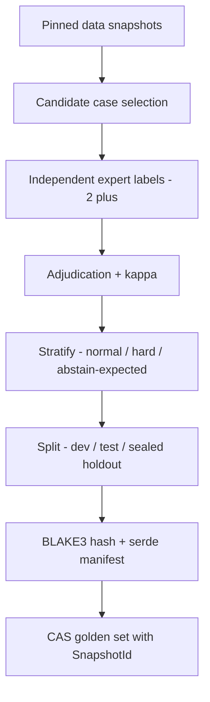
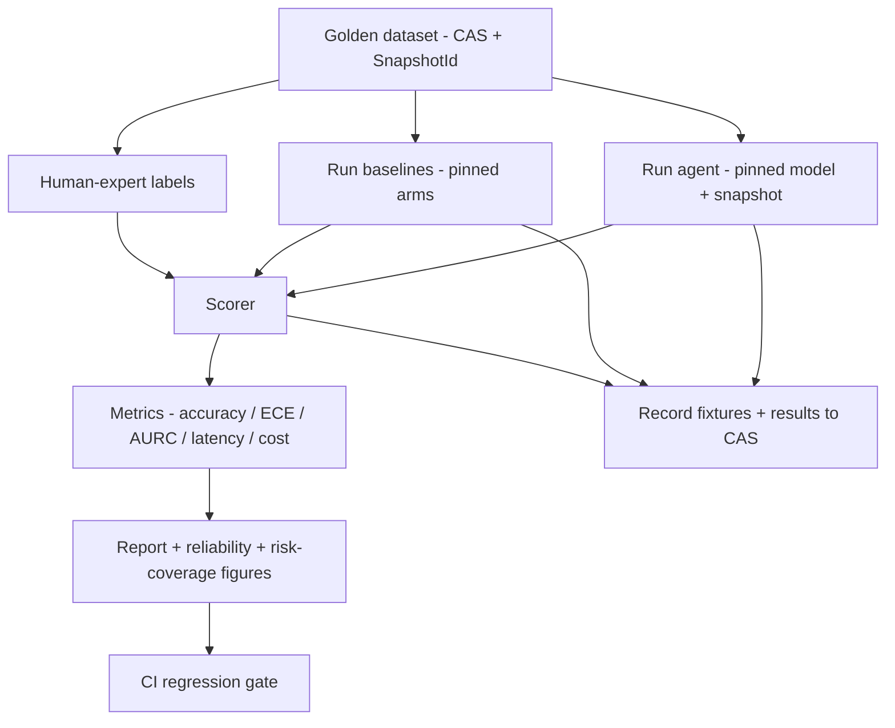

# Oncora — Evaluation & Benchmarking

This document specifies the **Reliability & benchmarking** pillar: how Oncora scores its agent output against **human-expert decisions** and **existing computational baselines**, and how it does so reproducibly enough to publish. The companion of this pillar is [03-uncertainty-reliability.md](03-uncertainty-reliability.md), which owns the calibration and abstention *machinery*; this document owns how we *measure, gate, and prove* it. Phasing of the benchmark program lives in [08-roadmap.md](08-roadmap.md).

The thesis is blunt: a claim that Oncora is "faster, more accurate, more reliable than experts and baselines" is worthless unless every reported number is (a) computed on a versioned, expert-labeled golden set, (b) compared against named baselines on a fair footing, (c) measured for calibration and abstention quality, not just accuracy, and (d) reproducible bit-for-bit from a manifest by a third party. The `oncora-eval` crate exists to make those four things non-negotiable and CI-enforced.

## Goal and scope

- **Score against two references, always.** Every benchmark task carries a **human-expert** reference decision/label and at least one **existing computational baseline** as a comparison arm. Agent-vs-self is not a benchmark.
- **Measure the right axes.** Accuracy/F1 *and* calibration (ECE) *and* abstention quality (coverage–risk, selective accuracy, AURC) *and* latency *and* cost. A system that is accurate but overconfident, or accurate but never abstains, fails the bar.
- **Be publishable.** A reviewer with the manifest and the snapshots can re-derive any figure in the paper with one command, and trace every reported number to the exact run that produced it.
- **Gate the codebase.** Regressions in accuracy, calibration, or abstention quality block merges. Latency regressions are caught by `criterion` microbenchmarks.

Out of scope here: the calibration methods themselves (conformal prediction, post-hoc calibration, ECE definition) — those are specified in [03-uncertainty-reliability.md](03-uncertainty-reliability.md) and consumed here as scorers.

## Golden datasets

A golden dataset is the contract between "what Oncora answered" and "what was true." For each of the three flagship workflows we curate a separate golden set, because the unit of evaluation differs.

### The three workflows and their evaluation unit

| Workflow | Unit of a case | Expert-labeled reference | Primary baselines (comparison arms) |
|---|---|---|---|
| **Target discovery** | A `(target, disease)` druggability/association question | Expert druggability/association call with rationale + cited evidence | Gene–disease association scorers; pathway-enrichment ranking; retrieval-only RAG |
| **Translational research** | A `(variant, compound, context)` sensitivity/resistance or mechanism question | Expert interpretation tied to guideline/curation tier | Standard variant-annotation pipeline; knowledge-base lookup; retrieval-only RAG |
| **Trial design / matching** | A `(cohort or patient profile, trial)` eligibility/match question, or a design-soundness question | Expert eligibility adjudication / design review | Trial-matching heuristics; rule-based eligibility filters; retrieval-only RAG |

> I am hedging the *exact* baseline tools deliberately (see [Baselines](#baselines)). The named families above are firm; the specific implementation behind each arm is pinned per benchmark run in the manifest, not in this prose.

### How golden sets are built and curated

1. **Source selection from pinned snapshots.** Candidate cases are drawn only from content-addressed data snapshots (the same snapshot machinery described in [04-knowledge-and-data.md](04-knowledge-and-data.md)). No golden case may reference live, drifting data — that would make the label irreproducible.
2. **Expert labeling.** Each case is independently labeled by ≥2 domain experts. The label is not just a verdict; it is `{decision, rationale, cited evidence, confidence}` so that we can score *both* the answer and whether Oncora cited the same evidence the expert relied on.
3. **Adjudication.** Disagreements go to a third senior expert. Inter-annotator agreement (Cohen's/Fleiss' κ) is recorded per set; cases below an agreement floor are flagged as **ambiguous** and either dropped or moved to a separate "hard/ambiguous" stratum where *abstention* is the expected behaviour.
4. **Negative and abstention cases.** Each set deliberately includes cases where the correct behaviour is to **abstain** (insufficient/contradictory evidence) and cases with a clear wrong-but-plausible distractor. Without these, abstention quality cannot be measured.
5. **Versioning + content addressing.** A finished golden set is serialized (`serde`), hashed with **BLAKE3**, and stored as a CAS artifact via `oncora-artifacts`. The set is referenced everywhere by its `SnapshotId`. Re-curation produces a new id; old ids remain replayable forever.
6. **Held-out splits.** Each set is partitioned into `dev` (visible during prompt/agent development), `test` (CI gate; visible to maintainers), and a **sealed `holdout`** (released only for publication / external audit, never used for tuning). Split membership is stored *inside* the content-addressed snapshot so a split cannot be silently reshuffled.



## Baselines

A benchmark is only credible if the comparison arms are strong and **fair**. Every task is scored against the human-expert reference *and* at least one computational baseline. Baselines run through the **same harness, same snapshots, same scorer** as the agent — identical inputs, identical metric code — so the only variable is the method under test.

| Workflow | Baseline family | What it represents | Fairness notes / hedges |
|---|---|---|---|
| Target discovery | Gene–disease association scorer | Established statistical association ranking | Exact scorer pinned per run; we report the version. Treat scores as a ranking arm, not ground truth |
| Target discovery | Retrieval-only RAG | "What a generic RAG chatbot would do" | Same retriever + corpus snapshot as Oncora, no agent loop / no verifier / no abstention |
| Translational | Standard variant-annotation pipeline | Conventional annotation + tiering | Specifics vary by deployment; pin the exact pipeline + reference build in the manifest |
| Translational | KB lookup | Direct knowledge-base answer | Exact-match lookup only; abstains when absent |
| Trial design / matching | Trial-matching heuristics | Rule/criteria-based eligibility filtering | Heuristic ruleset is itself versioned and hashed |
| All | Retrieval-only RAG | Ablation of the agentic stack | Isolates the *value of the agent loop* over plain retrieval |

Design rules for fair baselines:

- **Same inputs.** A baseline never sees data the agent didn't, and vice versa.
- **Abstention parity.** Baselines that can abstain are allowed to; baselines that cannot are scored at full coverage and that limitation is reported (it is the point).
- **No tuning on `test`/`holdout`.** Baseline hyperparameters are frozen from `dev` only.
- **Pinned + cited.** Every baseline arm records its implementation id/version into the `RunResult`, so a reviewer knows exactly what "the baseline" was.

## Metrics

Oncora reports a fixed metric panel per workflow. Calibration and abstention are **first-class**, not footnotes — that is the whole pillar.

| Metric | What it measures | Target / gate |
|---|---|---|
| Accuracy / F1 (task-specific) | Correctness of accepted answers vs expert label | Must not drop > **1.0 pp** vs last green main; must beat strongest baseline |
| Task-specific score | E.g. ranking metric for discovery, eligibility F1 for matching | Beat strongest baseline arm on `test` |
| **ECE** (Expected Calibration Error) | Gap between stated calibrated confidence and empirical accuracy | ECE ≤ **0.05**; no regression > **0.01** vs main. Reliability diagram attached |
| Reliability diagram | Per-bin confidence vs accuracy curve | Visual artifact in every report; must be monotone-ish, no severe overconfidence band |
| **Coverage vs risk** | Risk (error rate) as a function of how much the system answers vs abstains | Risk–coverage curve attached; risk at fixed coverage must not regress |
| **Selective accuracy** | Accuracy *on the answered subset* at a target coverage | Selective accuracy at target coverage ≥ floor; must exceed full-coverage accuracy |
| **AURC** | Area under risk–coverage curve (lower is better) | AURC must not regress > **0.01** vs main |
| Abstention precision/recall | Did it abstain when it *should* (vs expert-abstain cases) | Abstain-recall floor on the abstain-expected stratum |
| Latency p50/p95 | Wall-clock per case, replayed | p95 within budget; microbench gate via `criterion` |
| Cost — tokens | Prompt+completion tokens per case | Reported; budget alert, not a hard gate by default |
| Cost — compute | GPU/CPU seconds per case | Reported; tracked for trend |

Notes:

- **Calibration is scored on calibrated confidence**, the `Confidence(f64)` with its `CalibrationMethod` tag from [03-uncertainty-reliability.md](03-uncertainty-reliability.md). We never score raw model logits.
- **Abstention quality is a metric, not an escape hatch.** Abstaining on everything trivially yields zero risk at zero coverage; the risk–coverage curve and selective accuracy expose that immediately.
- **Beating the expert** is measured on accuracy, calibration *and* latency simultaneously — a faster, equally-accurate, better-calibrated system is the win condition.

## Evaluation harness — `oncora-eval`

`oncora-eval` is the canonical benchmark crate. Per the workspace layout it depends on `oncora-core`, `oncora-agents`, and effectively everything beneath them (it must instantiate the full stack to replay a run). It depends *inward*; nothing depends on it except `oncora-cli`.

Responsibilities:

- **Deterministic replay from manifests.** A run is fully specified by a `RunManifest` (model pins, data snapshot ids, seeds, config hash). Given a manifest, the harness reconstructs the exact agent stack and re-executes — or replays from recorded fixtures — with no hidden state.
- **Pinned models + data snapshots.** The harness refuses to run against an unpinned model endpoint or a non-content-addressed dataset. Pins are the `ModelPin` and `SnapshotId` from the canonical `Provenance` type.
- **Records every run to CAS.** Inputs, raw model I/O fixtures, per-case `RunResult`s, computed `Score`s, and the final report are all content-addressed via `oncora-artifacts` (BLAKE3) and indexed in the Postgres provenance ledger. Every reported number is therefore traceable to the artifact that produced it.
- **Experiment tracking.** Each benchmark execution gets a stable `ExperimentId`; runs are queryable by `(workflow, split, model_pin, snapshot, git_commit)`. `tracing` spans (per the telemetry stack) correlate harness execution end-to-end.
- **Three-way comparison.** For every case it produces aligned results for **agent**, **human-expert reference**, and each **baseline** arm, scored by identical metric code.



## CI regression gating

Benchmarks run in CI on the `test` split on every PR that touches agent, retrieval, memory, uncertainty, or prompt code. A merge is **blocked** if any gate trips.

| Gate | Condition to block merge |
|---|---|
| Accuracy floor | Task accuracy/F1 drops > 1.0 pp vs last green main |
| Calibration floor | ECE rises > 0.01 vs main, or exceeds absolute ceiling 0.05 |
| Abstention floor | AURC regresses > 0.01, or abstain-recall on abstain-expected stratum drops below floor |
| Baseline dominance | Agent fails to beat the strongest baseline arm on the primary task metric |
| Latency | `criterion` microbench shows a statistically significant p95 regression beyond the tolerance band |
| Reproducibility | A recorded-fixture replay does not reproduce the prior `Score` within tolerance |

### Handling LLM nondeterminism

LLM sampling makes naive accuracy gates flaky. Oncora pins down nondeterminism on multiple fronts so the gate is trustworthy:

- **Seeds everywhere.** Sampling seed, self-consistency sample seeds, and any shuffling seed are fields in the `RunManifest` and recorded in `RunResult`.
- **Recorded fixtures (default in CI).** CI replays from **cached, content-addressed model I/O fixtures** captured on a prior full run, so the gate is deterministic and does not hit a GPU. Live-model runs happen on a schedule / nightly, not on every PR.
- **Caching.** Identical `(model_pin, prompt_hash, params, seed)` resolves to a cached completion in CAS — same input, same output, by construction.
- **Tolerance bands.** Where live stochasticity is unavoidable (nightly full runs), metrics are reported as mean ± CI over N replays and gated against a **tolerance band**, not a point value. A regression must exceed the band to block.
- **Snapshot tests (`insta`).** Prompts, assembled contexts, and manifests are locked with `insta` so an *unintended* prompt change is caught as a diff, separately from metric drift.
- **`criterion` microbenchmarks** guard latency-sensitive hot paths (retrieval fusion, scorer, manifest hashing) against regressions independently of the end-to-end LLM latency.

## Publish-grade reproducibility

The bar: a reviewer who has the repo at a commit and access to the pinned snapshots can reproduce any figure with **one command**, and can trace any number in the paper to its source artifact.

### Manifest contents

A `RunManifest` is the complete, content-addressed description of a benchmark run:

- **Model pins** — `ModelPin` per role (planner, specialists, verifier, calibrator), including weights digest, serving backend, and decode params.
- **Data snapshot ids** — `SnapshotId` for the golden set and for every underlying corpus/KG/omics snapshot used.
- **Seeds** — sampling, self-consistency, shuffling.
- **Config hash** — BLAKE3 of the fully-resolved (`figment`-merged) configuration.
- **Code provenance** — git commit + workspace lockfile digest.
- **Baseline arm pins** — version/id of each baseline implementation.
- **Manifest digest** — the BLAKE3 of all the above; *this id names the run*.

### One-command replay

```
oncora-cli eval replay --manifest <manifest-blake3>
```

This resolves the manifest from CAS, reconstructs the pinned stack, replays from fixtures (or live with `--live`), recomputes metrics, regenerates figures, and asserts the recomputed `Score` matches the recorded one within tolerance. Reproducing a specific figure is `oncora-cli eval figure --report <report-blake3> --id fig-3`.

### Provenance of every reported number

Each number in a report carries a back-pointer: `report → ExperimentId → RunManifest digest → per-case RunResult digests → recorded model-I/O fixtures`. The chain lives in CAS + the provenance ledger, so "where did 0.91 F1 come from" resolves to exact inputs, outputs, and config. This is the same `Provenance` contract used everywhere else in Oncora — benchmarks get no special exemption.

## Rust sketch — eval types

Illustrative, consistent with the canonical `oncora-core` types (`Confidence`, `Provenance`, `Verdict`, `ModelPin`, `SnapshotId`).

```rust
use oncora_core::{Confidence, ModelPin, Provenance, SnapshotId, Verdict};

/// A single scored unit of a golden set.
pub struct BenchmarkCase {
    pub id: CaseId,
    pub workflow: Workflow,           // TargetDiscovery | Translational | TrialDesign
    pub split: Split,                 // Dev | Test | Holdout
    pub stratum: Stratum,             // Normal | Hard | AbstainExpected
    pub input: serde_json::Value,     // task input, drawn from a pinned snapshot
    pub expert: ExpertLabel,          // reference decision + rationale + cited evidence
    pub snapshot: SnapshotId,         // the golden set this case belongs to
}

pub struct ExpertLabel {
    pub decision: Decision,
    pub rationale: String,
    pub cited_evidence: Vec<SourceRef>,
    pub annotator_agreement: f64,     // kappa for the case's set
}

/// One arm's output for one case: agent, a baseline, or replayed.
pub struct RunResult {
    pub case: CaseId,
    pub arm: Arm,                     // Agent | Baseline(name) | Expert
    pub verdict: Verdict,             // Accept | Abstain | Escalate
    pub answer: Option<Decision>,     // None when Abstain/Escalate
    pub confidence: Confidence,       // calibrated, with CalibrationMethod tag
    pub provenance: Provenance,       // sources, tool_calls, model, snapshot
    pub latency_ms: u64,
    pub cost: Cost,                   // tokens + compute seconds
    pub fixtures: Vec<ArtifactId>,    // recorded model I/O in CAS
}

/// Computed metrics for an arm over a split.
pub struct Score {
    pub arm: Arm,
    pub split: Split,
    pub accuracy: f64,
    pub task_metric: f64,
    pub ece: f64,
    pub aurc: f64,
    pub selective_accuracy_at: Vec<(f64, f64)>, // (coverage, accuracy)
    pub abstain_recall: f64,
    pub latency_p50_ms: u64,
    pub latency_p95_ms: u64,
    pub cost: Cost,
}

/// CI gate definition; evaluated against the last green main.
pub struct GatePolicy {
    pub max_accuracy_drop_pp: f64,    // e.g. 1.0
    pub max_ece_regression: f64,      // e.g. 0.01
    pub ece_ceiling: f64,             // e.g. 0.05
    pub max_aurc_regression: f64,     // e.g. 0.01
    pub min_abstain_recall: f64,      // floor on abstain-expected stratum
    pub must_beat_baseline: bool,     // strongest baseline arm
    pub latency_tolerance: ToleranceBand,
}

impl GatePolicy {
    /// Block the merge if any gate trips.
    pub fn evaluate(&self, current: &Score, baseline: &Score, main: &Score) -> GateOutcome {
        // compare current vs main (regression) and current vs strongest baseline (dominance)
        todo!()
    }
}

pub enum GateOutcome {
    Pass,
    Block { reasons: Vec<String> },
}
```

## Risks

- **Label quality.** Expert labels are themselves noisy; low inter-annotator agreement caps achievable accuracy. Mitigation: ≥2 annotators + adjudication, recorded κ, ambiguous cases routed to an abstain-expected stratum rather than forced into a binary truth.
- **Baseline fairness.** A weak or mis-tuned baseline produces a flattering but meaningless win. Mitigation: same harness/inputs/scorer, frozen-from-`dev` tuning, pinned + version-reported baseline arms, retrieval-only RAG ablation always present.
- **Overfitting to the golden set.** Tuning prompts/agents against visible splits inflates `test` numbers. Mitigation: sealed `holdout` never used for tuning, split membership baked into the content-addressed snapshot, periodic golden-set refresh with new `SnapshotId`s.
- **LLM nondeterminism.** Sampling variance makes gates flaky and results non-reproducible. Mitigation: seeds in the manifest, recorded-fixture replay as the CI default, CAS caching keyed on `(model, prompt, params, seed)`, tolerance bands on nightly live runs, `insta` to catch unintended prompt drift.
- **Snapshot/golden drift.** Re-curation can silently change what "the benchmark" means. Mitigation: content addressing — a changed set is a new id; old ids stay replayable; reports always cite the `SnapshotId` they ran on.
- **Cost/latency of full replay.** Live re-runs are GPU-expensive. Mitigation: fixture replay for CI, scheduled live runs, `criterion` microbenchmarks for the deterministic hot paths.
