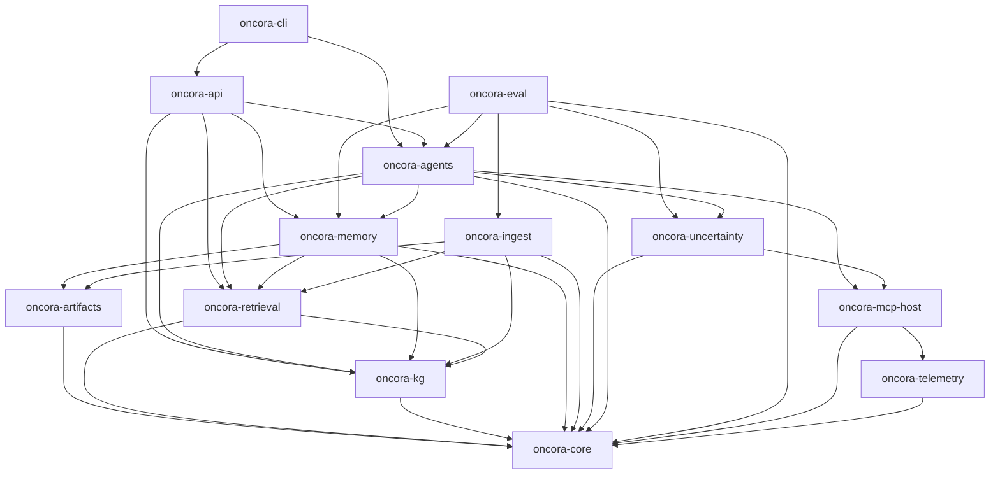

# Oncora — Repository Layout & Cargo Workspace

This document is the authoritative map of the Oncora source tree: the Cargo workspace, the crate-by-crate responsibilities, the swappable trait boundaries, the acyclic dependency graph, and the engineering best practices that make the build reproducible and the codebase auditable. It expands the *Cargo workspace* section of the internal design canon and is consistent with it: same crate names, same dependency direction, same trait set.

For the wider picture see [00-overview.md](00-overview.md) (problem and pillars), [01-architecture.md](01-architecture.md) (runtime topology), and [05-tech-decisions.md](05-tech-decisions.md) (the locked technology choices each crate consumes).

## Workspace philosophy

Oncora is a single Cargo **workspace** named `oncora`, with every crate namespaced `oncora-*`. The workspace is organized as a clean-architecture dependency graph, and the rules are non-negotiable:

- **Dependencies point inward toward `oncora-core`.** `oncora-core` holds the typed vocabulary of the platform — `Confidence`, `Provenance`, `Evidence`, `Verdict`, ids, errors, and the provider trait definitions. It depends on nothing internal. Everything else depends, directly or transitively, on it.
- **No cycles.** The internal dependency graph is a strict DAG. A crate may only depend on crates strictly closer to the core. This is enforced socially in review and mechanically by the fact that Cargo rejects cyclic crate dependencies at build time.
- **Providers are concrete impls of core traits.** The swappable boundaries — model backend, embedding backend, vector store, graph store, memory store, tool host, calibrator, verifier, artifact store — are **traits** declared near the core. Concrete implementations (an `async-openai` model client, a `qdrant` vector store, an `oxigraph` graph store) are isolated impls that depend inward on the trait. Higher layers program against the trait, never the concrete backend. This is how the canon's "non-Rust deps isolated behind Rust traits and justified" rule is realized in code: every C/C++/JVM-adjacent dependency (`ort`, `duckdb`, `foundationdb`) lives behind a trait and inside one crate.
- **Libs use `thiserror`; bins use `anyhow`.** Library crates expose typed, matchable error enums via `thiserror` so callers can branch on failure modes (and so `Verdict::Abstain`/`Escalate` can be driven by error class). Binary crates (`oncora-api`, `oncora-cli`, `xtask`) use `anyhow` for ergonomic top-level error handling with context. No library ever forces `anyhow` on its callers.

The payoff: any backend can be swapped — a different vector DB, a different local-inference engine, a cloud model behind the egress proxy — by writing one new impl crate/module and rebinding a trait object at composition time, with zero changes to `oncora-agents` or above.

## Crate-by-crate

| Crate | Responsibility | Depends on (internal) | Key public traits / types |
|---|---|---|---|
| `oncora-core` | Foundational typed vocabulary and the provider trait definitions. No internal deps. | — | `Confidence`, `Provenance`, `Evidence`, `Verdict`, `SourceRef`, `ToolCallId`, `ModelPin`, `SnapshotId`, `UncertaintySources`; traits `ModelProvider`, `EmbeddingProvider`, `VectorStore`, `GraphStore`, `MemoryStore`, `ToolHost`, `Calibrator`, `Verifier`, `ArtifactStore` |
| `oncora-telemetry` | Structured tracing + OpenTelemetry wiring; span helpers correlating agent runs and tool calls. | — | `init_tracing`, `RunSpan`, `ToolSpan`; `tracing`/`tracing-opentelemetry` setup |
| `oncora-artifacts` | Content-addressed store: BLAKE3 hashing, `serde`/CBOR manifests, object-store/FS backend. | `oncora-core` | `Cas`, `Manifest`, `ContentHash`; impl of `ArtifactStore` |
| `oncora-mcp-host` | `rmcp` host/client, tool registry, deterministic + audited tool dispatch. | `oncora-core`, `oncora-telemetry` | `McpHost`, `ToolRegistry`, `ToolCallRecord`; impl of `ToolHost` |
| `oncora-kg` | Dual knowledge graph: `oxigraph` ontology layer + `cozo` evidence graph; schema, SPARQL/Datalog. | `oncora-core` | `OntologyStore`, `EvidenceGraph`, schema entities/edges; impls of `GraphStore` |
| `oncora-retrieval` | Vector search over `qdrant`/`lancedb`, embeddings via `fastembed`, hybrid vector+graph+recency fusion. | `oncora-core`, `oncora-kg` | `HybridRetriever`, `FusionScore`; impls of `VectorStore`, `EmbeddingProvider` |
| `oncora-ingest` | `swiftide` pipelines for literature/omics/imaging/KG; snapshotting into CAS. | `oncora-core`, `oncora-kg`, `oncora-retrieval`, `oncora-artifacts` | `IngestPipeline`, `SnapshotBuilder`, source loaders |
| `oncora-memory` | Five memory types and the write/read paths; cross-session persistence. | `oncora-core`, `oncora-kg`, `oncora-retrieval`, `oncora-artifacts` | `WorkingMemory`, `EpisodicLog`, `SemanticMemory`, `ProceduralMemory`; impls of `MemoryStore` |
| `oncora-uncertainty` | Calibration, conformal prediction, verifiers, oracle grounding, abstention policy. | `oncora-core`, `oncora-mcp-host` | `Ece`, `ConformalPredictor`, `AbstentionPolicy`; impls of `Calibrator`, `Verifier` |
| `oncora-agents` | `rig`-backed planner / domain specialists / verifier / scorer / responder; the agent loop. | `oncora-core`, `oncora-memory`, `oncora-retrieval`, `oncora-kg`, `oncora-mcp-host`, `oncora-uncertainty` | `Planner`, `SpecialistAgent`, `AgentLoop`, `RunContext` |
| `oncora-eval` | Benchmark harness, golden sets, accuracy/calibration/abstention/latency metrics, CI gating. | `oncora-core`, `oncora-agents` + all | `Benchmark`, `GoldenSet`, `MetricSuite`, `CiGate` |
| `oncora-api` | `axum` + `tonic` services, auth, RBAC, request orchestration. | `oncora-agents`, `oncora-memory`, `oncora-retrieval`, `oncora-kg` | `ApiServer`, route handlers, `AuthLayer` |
| `oncora-cli` | Operator + developer CLI; deterministic run replay. | `oncora-api` / `oncora-agents` | `Cli`, subcommands `run`, `replay`, `ingest`, `eval` |

`oncora-eval` is the one crate that legitimately depends on "all" — it must exercise the full stack — so it sits high in the graph and is never depended upon by anything except the binaries that invoke it.

## Trait boundaries

The swappable seams live in (or near) `oncora-core`. Each is a small, object-safe trait with one clear contract. Concrete backends implement them in the crate that owns the relevant technology.

| Trait | One-line contract | Defined in | Implemented in |
|---|---|---|---|
| `ModelProvider` | Given a prompt/messages, return a completion or stream, with a `ModelPin` for reproducibility. | `oncora-core` | `oncora-agents` (clients: `async-openai`, Anthropic, `mistral.rs`/`candle`) |
| `EmbeddingProvider` | Embed text/multimodal items into fixed-width vectors, batched and deterministic. | `oncora-core` | `oncora-retrieval` (`fastembed`/`ort`, `candle`) |
| `VectorStore` | Upsert and ANN-search vectors with payload filtering, returning scored hits. | `oncora-core` | `oncora-retrieval` (`qdrant`, `lancedb`) |
| `GraphStore` | Assert/query graph entities and edges; ontology queries and time-traveled evidence queries. | `oncora-core` | `oncora-kg` (`oxigraph` SPARQL, `cozo` Datalog) |
| `MemoryStore` | Read/write versioned, attributed, content-addressed memory entries by `(scientist, project, workflow)`. | `oncora-core` | `oncora-memory` (`redb` + CAS, Postgres, `cozo`) |
| `ToolHost` | Register and invoke MCP tools deterministically; record every call to the audit trail. | `oncora-core` | `oncora-mcp-host` (`rmcp`) |
| `Calibrator` | Map raw model scores to a calibrated `Confidence`, tagging the `CalibrationMethod`. | `oncora-core` | `oncora-uncertainty` (Platt/isotonic/conformal) |
| `Verifier` | Check a claim against evidence/oracles; return support, contradiction, and a `Verdict` signal. | `oncora-core` | `oncora-uncertainty` (NLI entailment, oracle grounding) |
| `ArtifactStore` | Put/get content-addressed blobs and manifests by BLAKE3 hash; immutable, deduplicated. | `oncora-core` | `oncora-artifacts` (object store / FS CAS) |

### Trait sketch

```rust
//! Provider seams declared in `oncora-core`. Concrete backends live in the
//! crate that owns the underlying technology; higher layers depend only on
//! these traits. Errors are typed (`thiserror`) so callers can branch.

use async_trait::async_trait;

/// Pluggable text/chat model backend. Carries a `ModelPin` so any completion
/// is reproducible against a fixed model + decoding config.
#[async_trait]
pub trait ModelProvider: Send + Sync {
    async fn complete(&self, req: CompletionRequest) -> Result<Completion, ModelError>;
    fn pin(&self) -> ModelPin;
}

/// Approximate-nearest-neighbour vector store with payload filtering.
#[async_trait]
pub trait VectorStore: Send + Sync {
    async fn upsert(&self, points: Vec<VectorPoint>) -> Result<(), StoreError>;
    async fn search(&self, query: VectorQuery) -> Result<Vec<ScoredHit>, StoreError>;
}

/// Post-hoc calibration of raw scores into a typed, tagged `Confidence`.
pub trait Calibrator: Send + Sync {
    fn calibrate(&self, raw: f64, ctx: &CalibrationContext) -> Confidence;
    fn method(&self) -> CalibrationMethod;
}

/// Content-addressed artifact store: immutable, deduplicated, BLAKE3-keyed.
#[async_trait]
pub trait ArtifactStore: Send + Sync {
    async fn put(&self, bytes: &[u8]) -> Result<ContentHash, CasError>;
    async fn get(&self, hash: &ContentHash) -> Result<Vec<u8>, CasError>;
}
```

## Crate dependency graph

Arrows mean *depends on*. The graph is acyclic and points inward toward `oncora-core`. `oncora-eval` and the binaries sit at the top; the foundational crates sit at the bottom.



## Repository tree

The workspace root carries the build, lint, and CI configuration; every crate follows the same `src/`, `tests/`, `benches/` shape. An `xtask/` crate hosts repository automation (snapshot pinning, deny audits, codegen) so contributors run `cargo xtask <task>` rather than ad-hoc scripts.

```
oncora/
├── Cargo.toml                  # [workspace] root: members + workspace.dependencies
├── Cargo.lock                  # committed: locked, reproducible deps
├── rust-toolchain.toml         # pinned toolchain + components (rustfmt, clippy)
├── deny.toml                   # cargo-deny: licenses, bans, advisories, sources
├── rustfmt.toml                # formatting config
├── clippy.toml                 # lint config
├── .gitignore
├── README.md
├── docs/
│   ├── 00-overview.md
│   ├── 01-architecture.md
│   ├── 02-memory.md
│   ├── 03-uncertainty-reliability.md
│   ├── 04-knowledge-and-data.md
│   ├── 05-tech-decisions.md
│   ├── 06-eval-benchmarking.md
│   ├── 07-repo-layout.md
│   ├── 08-roadmap.md
│   └── adr/                    # Architecture Decision Records, numbered
│       ├── 0001-rust-native.md
│       └── 0002-mcp-for-all-tools.md
├── .github/
│   └── workflows/
│       ├── ci.yml              # fmt, clippy -D warnings, test, doc, deny
│       ├── bench.yml           # criterion regression tracking
│       └── eval.yml            # oncora-eval golden-set CI gate
├── crates/
│   ├── oncora-core/
│   │   ├── Cargo.toml
│   │   ├── src/
│   │   │   ├── lib.rs
│   │   │   ├── types.rs        # Confidence, Provenance, Evidence, Verdict
│   │   │   ├── ids.rs          # ToolCallId, ModelPin, SnapshotId, SourceRef
│   │   │   ├── error.rs        # thiserror enums
│   │   │   └── traits.rs       # ModelProvider, VectorStore, ... seams
│   │   ├── tests/
│   │   └── benches/
│   ├── oncora-telemetry/{src,tests}
│   ├── oncora-artifacts/{src,tests,benches}
│   ├── oncora-mcp-host/{src,tests}
│   ├── oncora-kg/{src,tests,benches}
│   ├── oncora-retrieval/{src,tests,benches}
│   ├── oncora-ingest/{src,tests}
│   ├── oncora-memory/{src,tests,benches}
│   ├── oncora-uncertainty/{src,tests,benches}
│   ├── oncora-agents/{src,tests}
│   ├── oncora-eval/{src,tests}
│   ├── oncora-api/{src,tests}
│   └── oncora-cli/{src,tests}
├── xtask/                      # cargo xtask automation
│   ├── Cargo.toml
│   └── src/main.rs
└── fuzz/                       # cargo-fuzz targets (VCF, DICOM, tool args)
    ├── Cargo.toml
    └── fuzz_targets/
```

## Workspace `Cargo.toml`

Versions below are **illustrative and must be verified/pinned** against the current ecosystem before use; `rig`, `swiftide`, `mistral.rs`, and `lancedb` move fast and require explicit version verification (see [05-tech-decisions.md](05-tech-decisions.md) maturity notes). The point of `[workspace.dependencies]` is that every crate inherits one pinned version of each shared dependency.

```toml
[workspace]
resolver = "2"
members = [
  "crates/oncora-core",
  "crates/oncora-telemetry",
  "crates/oncora-artifacts",
  "crates/oncora-mcp-host",
  "crates/oncora-kg",
  "crates/oncora-retrieval",
  "crates/oncora-ingest",
  "crates/oncora-memory",
  "crates/oncora-uncertainty",
  "crates/oncora-agents",
  "crates/oncora-eval",
  "crates/oncora-api",
  "crates/oncora-cli",
  "xtask",
]

[workspace.package]
edition = "2024"
rust-version = "1.85"          # edition 2024 requires >= 1.85; mirror rust-toolchain.toml
license = "Proprietary"
repository = "https://git.internal/oncora"

[workspace.dependencies]
# --- internal crates (path deps, version-synced) ---
oncora-core        = { path = "crates/oncora-core" }
oncora-telemetry   = { path = "crates/oncora-telemetry" }
oncora-artifacts   = { path = "crates/oncora-artifacts" }
oncora-mcp-host    = { path = "crates/oncora-mcp-host" }
oncora-kg          = { path = "crates/oncora-kg" }
oncora-retrieval   = { path = "crates/oncora-retrieval" }
oncora-ingest      = { path = "crates/oncora-ingest" }
oncora-memory      = { path = "crates/oncora-memory" }
oncora-uncertainty = { path = "crates/oncora-uncertainty" }
oncora-agents      = { path = "crates/oncora-agents" }

# --- runtime / web / rpc (versions illustrative) ---
tokio       = { version = "1", features = ["full"] }
axum        = "0.7"
tonic       = "0.12"
tower       = "0.5"
tower-http  = "0.6"

# --- agents / llm / ingest (VERIFY — fast-moving) ---
rig-core    = "0.4"
swiftide    = "0.16"
async-openai = "0.27"

# --- stores / data ---
qdrant-client = "1"
lancedb       = "0.10"
oxigraph      = "0.4"
cozo          = "0.7"
polars        = "0.43"
duckdb        = "1"
redb          = "2"
sqlx          = { version = "0.8", features = ["postgres", "runtime-tokio"] }

# --- domain io ---
noodles  = "0.83"
dicom    = "0.7"
rmcp     = "0.1"

# --- serialization / hashing / errors ---
serde      = { version = "1", features = ["derive"] }
serde_json = "1"
ciborium   = "0.2"
blake3     = "1"
thiserror  = "2"
anyhow     = "1"

# --- observability / config ---
tracing               = "0.1"
tracing-opentelemetry = "0.28"
opentelemetry         = "0.27"
figment               = { version = "0.10", features = ["toml", "env"] }

# --- testing / quality ---
proptest  = "1"
insta     = "1"
criterion = "0.5"
```

Each member crate then writes, e.g.:

```toml
[dependencies]
oncora-core = { workspace = true }
tokio       = { workspace = true }
thiserror   = { workspace = true }   # libraries
# anyhow = { workspace = true }      # binaries only
```

## Engineering best practices

### Documentation standards

- **Rustdoc on every public item.** `#![deny(missing_docs)]` on library crates. Every public trait, type, and function carries a doc comment; module-level `//!` docs explain the crate's role and its place in the dependency graph.
- **Doc-tests.** Public API examples are runnable doc-tests, executed by `cargo test --doc`. They double as compile-checked usage docs — critical for the provider trait seams.
- **The `docs/` set.** The numbered design docs (`00`–`08`) plus the canon are the prose architecture; this file (`07`) is their structural index. Docs cross-reference with relative links and must stay consistent with the canon.
- **ADRs.** Significant decisions land in `docs/adr/NNNN-title.md` (context → decision → consequences). The locked technology table in [05-tech-decisions.md](05-tech-decisions.md) is the rolled-up summary; ADRs hold the per-decision reasoning and any later supersessions.

### Quality gates

Enforced in `.github/workflows/ci.yml`; a PR cannot merge unless all pass:

- **Formatting** — `cargo fmt --all --check`.
- **Lints** — `cargo clippy --all-targets --all-features -- -D warnings`. Warnings are errors.
- **Dependency policy** — `cargo deny check` against `deny.toml` (licenses, security advisories, banned/duplicate crates, allowed sources). This is where non-Rust/native deps are gate-kept.
- **Tests + coverage** — `cargo test --workspace`, with coverage (`cargo llvm-cov`) tracked and a floor enforced on core/uncertainty/memory crates.
- **Property tests + fuzzing** — `proptest` invariants on memory, uncertainty, and parsers; `cargo-fuzz` targets for the risky parsers (VCF, DICOM, JSON tool args) run in scheduled CI.
- **Benchmarks** — `criterion` microbenchmarks with regression tracking in `bench.yml`; latency/throughput regressions are flagged.
- **Eval gate** — `oncora-eval` runs golden sets and gates CI on accuracy / calibration (ECE) / abstention / latency, so reasoning regressions cannot merge (see [06-eval-benchmarking.md](06-eval-benchmarking.md)).

### Reproducibility criteria

- **Pinned toolchain** — `rust-toolchain.toml` pins the channel and components; CI uses exactly that toolchain.
- **Locked dependencies** — `Cargo.lock` is committed; `[workspace.dependencies]` gives a single resolved version per crate; `cargo deny` blocks duplicate/unexpected versions.
- **Content-addressed artifacts** — models, data snapshots, manifests, and run outputs are BLAKE3-addressed via `oncora-artifacts`, so a run pins its `ModelPin` + `SnapshotId` and can be replayed deterministically (`oncora-cli replay`). Snapshot tests (`insta`) lock prompts, traces, and manifests against drift.

## Pillar / requirement → crate mapping

| Pillar / requirement | Delivering crate(s) |
|---|---|
| Multimodal reasoning | `oncora-retrieval`, `oncora-kg`, `oncora-ingest`, `oncora-agents` |
| Agent memory architecture | `oncora-memory`, `oncora-kg`, `oncora-artifacts` |
| Robustness & uncertainty | `oncora-uncertainty`, `oncora-core` types, `oncora-mcp-host` oracles |
| Reliability & benchmarking | `oncora-eval`, `oncora-telemetry` |
| MCP for all domain tools | `oncora-mcp-host` |
| Provenance on every claim | `oncora-core` `Provenance`, `oncora-artifacts`, `oncora-memory` ledger |
| Reproducibility / replay | `oncora-artifacts`, `oncora-cli` replay, pinned toolchain + `Cargo.lock` |
| Typed calibrated confidence | `oncora-core` `Confidence`/`Verdict`, `oncora-uncertainty` |
| On-prem / privacy / RBAC | `oncora-api` auth+RBAC, on-prem provider impls behind core traits |
| Observability | `oncora-telemetry` |
| Provider swappability | `oncora-core` traits + per-backend impls in owning crates |
