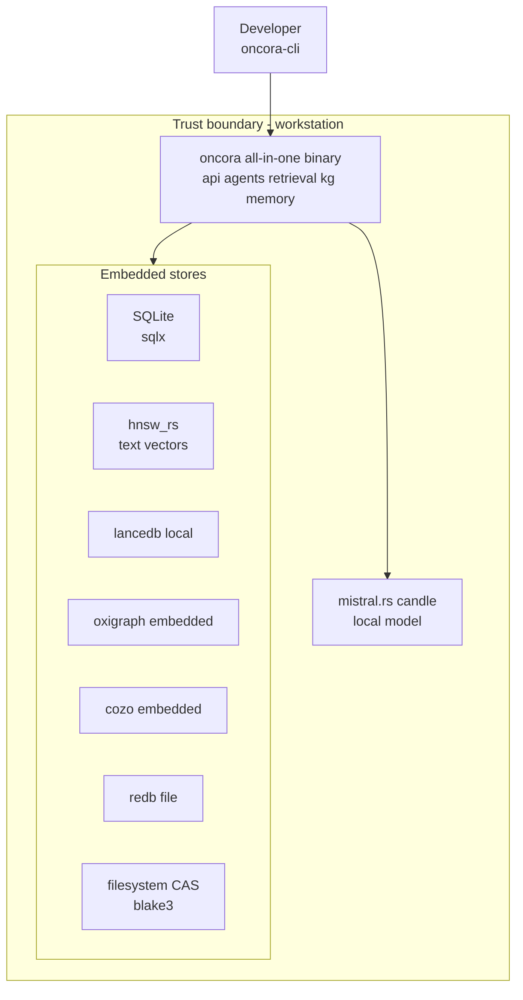
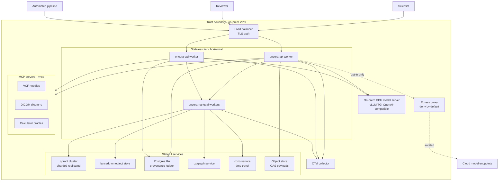
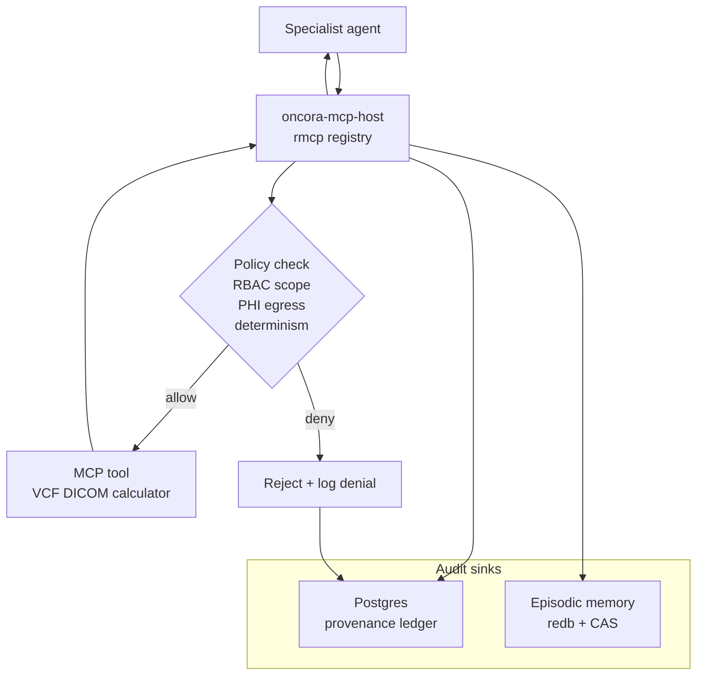
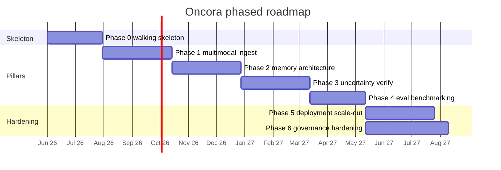

# 08 — Roadmap, Deployment & Governance

> Roadmap, deployment/scaling/ops, and security/privacy/governance for **Oncora** (Oncology Reasoning Agents).
> Authoritative decisions live in the internal design canon; this document operationalizes the **Deployment (canonical)** section and the locked crate list.
> Related: [00-overview.md](00-overview.md) · [01-architecture.md](01-architecture.md) · [02-memory.md](02-memory.md) · [03-uncertainty-reliability.md](03-uncertainty-reliability.md) · [04-knowledge-and-data.md](04-knowledge-and-data.md) · [05-tech-decisions.md](05-tech-decisions.md) · [06-eval-benchmarking.md](06-eval-benchmarking.md) · [07-repo-layout.md](07-repo-layout.md)

This document closes the design with the three things a review board asks before approving a build: **how it runs** (deployment, scaling, ops), **how it is controlled** (security, privacy, governance), and **how we get there without betting the program on an unvalidated assumption** (the phased, risk-gated roadmap). It is decisive by construction — every choice traces back to a locked decision in the canon, and every phase carries an explicit de-risking spike so that the riskiest assumptions are tested first, cheaply.

---

## A. Deployment, Scaling & Ops

### A.1 Deployment principle

Oncora ships as **one Cargo workspace, two deployment shapes**. The same crates (`oncora-api`, `oncora-agents`, `oncora-retrieval`, `oncora-kg`, `oncora-memory`, …) run as a single all-in-one binary on a laptop and as a fleet of stateless workers behind a load balancer in a VPC — the difference is configuration (`figment`/`config` layered env + file), not code. Provider-swappable trait boundaries (`ModelProvider`, `VectorStore`, `GraphStore`, `MemoryStore`, `ArtifactStore`) let us swap an embedded dev backend for a clustered production backend without touching the agent runtime. This is the canon's deployment contract: **dev is single-node embedded; scaled is multi-node service-backed; the trust boundary is the VPC.**

### A.2 Dev topology — single node, embedded

For development, evaluation authoring, and CI, everything runs in-process or as embedded stores. No external services, no GPU required, no network egress. This is the substrate `oncora-cli` drives for deterministic replay and the substrate `oncora-eval` runs golden sets against.

| Concern | Dev choice | Why |
|---|---|---|
| Process model | single all-in-one binary | Fast inner loop; no orchestration |
| Relational + provenance | SQLite via `sqlx` | Zero-ops; same `sqlx` query layer as Postgres |
| Text vectors | embedded `hnsw_rs` / `instant-distance` | No qdrant server needed for small corpora |
| Multimodal vectors | `lancedb` local files | Columnar Lance format on disk |
| KG | `oxigraph` + `cozo` embedded | Both run in-process pure-Rust |
| Working/episodic | `redb` file | Pure-Rust ACID embedded KV |
| CAS | local filesystem object store | `blake3`-addressed files |
| Model | local `mistral.rs` / `candle` | Runs on a workstation; no external endpoint |
| Telemetry | `tracing` to stdout / local OTel | Inspectable without a collector |

### A.3 Scaled topology — multi-node, service-backed

For production the stateless tier scales horizontally and every store becomes a managed service inside the VPC. The canon fixes the membership: stateless `oncora-api` agent workers, a qdrant cluster, Postgres HA, cozo/oxigraph services, an on-prem GPU model server (vLLM/TGI, OpenAI-compatible), an OTel collector, and an object store for CAS.

| Concern | Scaled choice | Why |
|---|---|---|
| Stateless agent tier | N replicas of `oncora-api` + `oncora-agents` behind LB | Horizontal scale; no per-replica state |
| Retrieval tier | horizontally scaled `oncora-retrieval` workers | Embedding + fusion is CPU-bound and parallel |
| Text vectors | qdrant **cluster** (sharded + replicated) | Canon primary; payload filtering + HNSW + quantization |
| Multimodal vectors | `lancedb` over shared object store | Versioned imaging embeddings |
| Relational + provenance | Postgres **HA** (primary + replicas) via `sqlx` | Durable provenance ledger; failover |
| KG | `oxigraph` service + `cozo` service | Shared canonical + evidence graph; cozo time-travel |
| Working/episodic | `redb` per-worker + Postgres rollup; FoundationDB optional at very large scale | Hot local KV, durable ledger; canon flags FDB as phase-gated |
| CAS | object store (S3-compatible, on-prem) | Content-addressed, shared, durable |
| Model serving | on-prem GPU vLLM/TGI OpenAI-compatible | Canon default; behind `ModelProvider` |
| Cloud model | opt-in only, via egress proxy | PHI never leaves boundary; pinned + audited |
| Telemetry | OTel collector → trace/metric backend | Correlate runs across workers |

### A.4 Model endpoint abstraction

Inference is hidden behind the `ModelProvider` trait (canon §traits). There is exactly one rule that matters for deployment: **on-prem is the default, cloud is opt-in behind the egress proxy**, and the choice is recorded in the run's `ModelPin` for reproducibility.

| Mode | Backend | Path | When |
|---|---|---|---|
| Dev local | `mistral.rs` / `candle` | in-process | Workstation, CI |
| On-prem served | vLLM / TGI OpenAI-compatible via `async-openai` | VPC-internal HTTP | **Default production** |
| Cloud opt-in | Anthropic / OpenAI-compatible | **egress proxy only** | Explicit, audited, non-PHI tasks |

The egress proxy is the **only** sanctioned outbound path; it is deny-by-default, allow-lists specific endpoints, strips/blocks PHI, and logs every call. A run that touches a cloud endpoint stamps that fact into its model pin so a reviewer can see it.

### A.5 Deployment topology diagram

Two views, with the trust boundary drawn as an explicit subgraph in each.

**Dev — single node, embedded:**

**Scaled — multi-node, service-backed:**

The scaled view preserves the canon's dependency direction: the stateless tier holds the agent runtime, the stateful services are concrete providers behind core traits, and **the only arrow that crosses the trust boundary is the audited egress proxy**.

### A.6 Scaling model

| Tier | Stateless? | Scaling axis | Bottleneck | Mitigation |
|---|---|---|---|---|
| `oncora-api` + agents | Yes | Replicas behind LB | GPU model concurrency | Semaphore-bounded model calls; queue + backpressure |
| `oncora-retrieval` | Yes | Replicas | Embedding throughput | Batched `fastembed`; cache hot embeddings |
| qdrant | No | Shards + replicas | ANN over large corpora | Sharding; quantization; payload pre-filter |
| Postgres | No | Read replicas; vertical primary | Provenance write volume | Append-only ledger; partition by time |
| cozo / oxigraph | No | Vertical; read replicas | Time-travel query depth | Snapshot pinning; query budgets |
| Model server | No | GPUs / model replicas | Tokens per second | vLLM continuous batching; per-task model tiering |
| Object store CAS | No | Native object-store scale | Throughput | Native horizontal object store |

The agent and retrieval tiers are stateless precisely so they scale by adding replicas; all durable state lives in the data tier. The hard ceiling is **GPU token throughput**, which is why on-prem model throughput is an early de-risking spike (§C) and why uncertainty-driven abstention is also a cost control — the system does not burn tokens self-consisting on a question it should escalate.

### A.7 Ops decision table

| Concern | Approach | Tooling |
|---|---|---|
| Packaging | Single workspace, per-binary OCI images | `cargo`, multi-stage container build |
| Orchestration | Declarative deploy of stateless + stateful tiers | Kubernetes (or Nomad) in VPC |
| Config | Layered env + file, validated at boot | `figment` / `config` + `serde` |
| Secrets | No secrets in images/env files; fetched at runtime | Vault / KMS; short-lived tokens |
| Resource isolation | CPU/mem limits per tier; GPU node pool for model server | cgroups / k8s requests-limits; taints |
| Service-to-service | mTLS inside the mesh; `tonic` gRPC | `tower` middleware; mesh mTLS |
| Upgrade | Rolling deploy of stateless tier; expand-contract migrations for stores | `sqlx migrate`; rolling update |
| Rollback | Pinned image tags; reversible migrations; replay to confirm | image pin; `oncora-cli` replay |
| Schema migrations | Forward-only, backward-compatible per release | `sqlx migrate` |
| Observability | Structured spans + metrics correlated by run id | `tracing` + `tracing-opentelemetry` + OTel collector |
| Health / readiness | Liveness + readiness probes per service | `axum` health endpoints |
| Backpressure / overload | Bounded queues; load-shed before OOM | `tower` concurrency-limit + `tokio` semaphores |
| Data snapshots | Immutable, versioned, content-addressed | CAS + `SnapshotId` (see [04-knowledge-and-data.md](04-knowledge-and-data.md)) |
| Backup / DR | Postgres PITR; object-store versioning; KG snapshot export | pg backup; object-store replication |
| Capacity / cost | Token budgets per task class; abstention as cost control | semaphore caps; eval-tracked latency |

**Upgrade/rollback discipline.** Because every run pins models, snapshots, and content-addressed artifacts (canon: reproducibility), an upgrade is validated by **replaying a golden set on the new build and diffing against the recorded baseline** ([06-eval-benchmarking.md](06-eval-benchmarking.md)). A rollback is therefore never a guess: re-pin the prior image, run the same replay, confirm the diff is empty. Migrations are expand-contract so a rollback never strands the schema.

---

## B. Security, Privacy & Governance

### B.1 Trust boundary enforcement

The trust boundary is the VPC (canon; [01-architecture.md](01-architecture.md) §1.2). PHI and IP never leave it. The enforcement is layered and deny-by-default:

- **Network.** Stateless tier reachable only via the authenticated LB; data-tier services are not internet-routable; the **egress proxy is the single sanctioned outbound path** and allow-lists specific endpoints.
- **Identity.** Every caller (scientist, reviewer, pipeline service identity) authenticates at `oncora-api`; service-to-service is mTLS.
- **Data.** Source snapshots are **read-only**; there is no code path that writes back to a source system (canon non-negotiable).
- **Model.** On-prem by default; cloud only through the proxy, with PHI stripped/blocked and the fact recorded in the model pin.

### B.2 Audit trail — every tool call recorded

The canon requires deterministic, auditable tool calls. `oncora-mcp-host` is the single chokepoint: it validates inputs (fuzz-tested via `cargo-fuzz`), resolves the tool to its MCP server, enforces a `tower` timeout, executes **deterministically**, and records the call — inputs, outputs, model pin, snapshot, `ToolCallId`, latency, verdict — to **both** episodic memory (`redb` + CAS payloads) and the **Postgres provenance ledger**. There is no path to call a domain tool that bypasses this recorder. Determinism + content-addressing means the audit trail is replayable: `oncora-cli` can re-run any tool call and reproduce its output bit-for-bit.

### B.3 Audited tool-call path diagram

Both allow and **deny** are recorded — a refused tool call is itself an audit event. The agent only ever receives a tool result after the call has been written to the ledger and episodic log.

### B.4 Data lineage & provenance ledger

Provenance is a typed first-class value (`Provenance { sources, tool_calls, model, snapshot }`, canon). The **Postgres provenance ledger** is the durable lineage store: it links every memory item, claim, and answer to the sources it derived from, the tool calls that produced it, the model pin, and the data snapshot. Because the ledger is append-only and content-addressed (CAS via `blake3`), lineage is tamper-evident and reconstructable — a reviewer can walk from any returned sentence back through its `Evidence`, its `ToolCallId`s, to the exact snapshot lines. This is what makes Oncora reproducible enough to publish and the substrate for the GxP-adjacent expectations in B.7.

### B.5 Access control / RBAC, redaction, no writes to source

| Control area | Mechanism |
|---|---|
| Authentication | All entry at `oncora-api`; mTLS service identities |
| Authorization | RBAC at `oncora-api` and re-checked at the MCP host policy gate |
| Roles | Scientist · Reviewer · Pipeline · Operator, scoped per `(project, workflow)` |
| Redaction / PII | PHI tagged at ingest; redacted in logs/traces; blocked at egress proxy |
| Source immutability | No write path to source systems; snapshots read-only |
| Memory scoping | Memory keyed by `(scientist, project, workflow)`; cross-tenant reads denied |
| Reviewer gate | Promotions to semantic memory and escalations require reviewer approval |

### B.6 Governance decision table

| Control | Mechanism | Where enforced |
|---|---|---|
| Authentication | Token / mTLS identity | `oncora-api` (edge) |
| Authorization / RBAC | Role + project/workflow scope | `oncora-api` + MCP host policy gate |
| Tool-call audit | Deterministic record of every call | `oncora-mcp-host` → ledger + episodic |
| Data lineage | Provenance on every claim | Postgres provenance ledger + CAS |
| PHI / PII redaction | Tag at ingest, redact in logs, block at egress | `oncora-ingest`, telemetry, egress proxy |
| No writes to source | Read-only snapshot inputs | `oncora-ingest` (no write path exists) |
| Egress control | Deny-by-default allow-list | Egress proxy |
| Reproducible replay | Pinned model + snapshot + CAS artifacts | `oncora-artifacts` + `oncora-cli` |
| Abstention / escalation | Typed `Verdict`; logged with reason | `oncora-uncertainty` → responder |
| Reviewer adjudication | Human-in-the-loop approval queue | `oncora-api` review queue |
| Change control | Replay-gated CI; pinned images | `oncora-eval` CI gate |

### B.7 GxP-adjacent reproducibility expectations

Oncora is not a validated GxP system out of the box, but it is **built to meet the spirit of the relevant controls** so it can feed regulated work:

- **Attributable** — every action carries an identity and is recorded.
- **Legible & contemporaneous** — structured spans written at the time of the action (`tracing`/OTel).
- **Original & accurate** — content-addressed artifacts (`blake3`); no silent overwrite — contradictions are kept as competing evidence (canon memory write path).
- **Reproducible** — pinned models + snapshots + deterministic replay yield bit-for-bit re-derivation.
- **Auditable** — append-only provenance ledger; every tool call and verdict recoverable.

This maps cleanly onto ALCOA+ expectations and gives a review board a concrete trail for any answer that influences a go/no-go or a submission.

---

## C. Phased Roadmap

The roadmap is **risk-gated**: each phase exists to retire a specific class of risk, and each carries explicit **de-risking spikes** that test the canon's youngest/fastest-moving bets (`rig`, `rmcp`, `swiftide`, `cozo` time-travel, conformal calibration, on-prem model throughput) *before* we build the thick layer on top of them. A spike that fails routes us to the canon's named fallback — that is why the canon records a fallback for every young dependency.

### Phase 0 — Walking skeleton

**Goal.** One end-to-end thin slice that exercises **every crate** at minimal depth, proving the architecture's spine before any pillar is thickened. The slice: a **target-discovery query** that retrieves (hybrid), reasons, calls **one** MCP tool, verifies, and returns a **confidence-scored, cited** answer.

**Scope (minimal of every crate).**

| Crate | Phase-0 minimum |
|---|---|
| `oncora-core` | `Confidence`, `Provenance`, `Evidence`, `Verdict`, ids, errors |
| `oncora-telemetry` | `tracing` spans to stdout/local OTel |
| `oncora-artifacts` | `blake3` CAS over local FS; one manifest type |
| `oncora-mcp-host` | `rmcp` host; **one** registered tool; audit to ledger + episodic |
| `oncora-kg` | `oxigraph` + `cozo` embedded; minimal Target/Disease/Evidence schema |
| `oncora-retrieval` | `fastembed` embeddings; one vector index; basic vector+graph fusion |
| `oncora-ingest` | `swiftide` ingest of one small literature snapshot |
| `oncora-memory` | working + episodic + provenance write/read (semantic stub) |
| `oncora-uncertainty` | one calibration method; citation-entailment verifier; threshold verdict |
| `oncora-agents` | `rig` planner → one specialist → verifier → scorer → responder |
| `oncora-eval` | 10–20 golden target-discovery questions; accuracy + abstention metrics |
| `oncora-api` | one authenticated query endpoint |
| `oncora-cli` | submit query + **replay** a recorded run |

**Key deliverables.** A single query returns an `Evidence`-bearing answer with a calibrated `Confidence`, citations resolvable to the snapshot, a full audit trail in the ledger, and a `Verdict` that can be `Abstain`. Deterministic replay reproduces the run from CAS.

**Exit / done-criteria.**
- A target-discovery query runs end-to-end and returns a cited, confidence-scored answer **or** a logged abstention.
- The single MCP tool call is recorded to ledger **and** episodic memory.
- `oncora-cli replay` reproduces the run bit-for-bit from pinned model + snapshot + CAS.
- The golden set runs in CI and gates the build.

**Risks & de-risking spikes.**
- **Spike: verify `rig` tool-calling + streaming** against an OpenAI-compatible on-prem endpoint. If immature → fall back to in-house orchestrator on raw `async-openai` (canon fallback).
- **Spike: verify `rmcp` tool maturity** — register, route, audit one tool round-trip. If gaps → wrap behind `ToolHost` and patch minimally.
- **Risk:** the spine leaks abstraction (a store type bleeds into `oncora-agents`). *Mitigation:* trait-boundary review before Phase 1.

### Phase 1 — Multimodal ingestion (literature → omics → imaging)

**Goal.** Thicken pillar 1: turn the single-modality skeleton into true cross-modal evidence assembly.

**Key deliverables.** `swiftide` pipelines for literature, then structured omics (`polars`/`duckdb` over Parquet, `noodles` VCF behind an MCP server), then imaging (`dicom-rs` behind an MCP server, `lancedb` multimodal embeddings). KG schema fully populated (Target/Disease/Pathway/Compound/Variant/Trial/Cohort + edges). Hybrid retrieval fuses vector + graph + recency across all modalities.

**Exit criteria.** A query that requires literature **and** omics **and** imaging evidence returns one fused, cited answer; each modality is content-addressed and snapshot-tagged; no source is ever written to.

**Risks & spikes.**
- **Spike: VCF/DICOM parser robustness** — fuzz `noodles`/`dicom-rs` inputs (`cargo-fuzz`) on real-world malformed files.
- **Spike: `lancedb` multimodal embedding scale** on a representative imaging set.
- **Spike: `swiftide` pipeline contract** — confirm we own the contract; fall back to a custom `tokio` pipeline if it constrains us (canon fallback).
- **Risk:** entity resolution across vocabularies (HGNC/UMLS/MONDO). *Mitigation:* oxigraph URI grounding + dedup in the memory write path.

### Phase 2 — Memory architecture

**Goal.** Thicken pillar 2: full five-type memory with the canonical write/read paths and cross-session persistence.

**Key deliverables.** Working/episodic/semantic/procedural/provenance memory wired to their canonical stores. Write path: extract → dedup (embedding + KG entity resolution) → conflict resolution (recency + authority + confidence; contradictions kept) → consolidation (working→episodic→semantic) → decay/forgetting (tombstones, never lose provenance). Read path: hybrid retrieval fused under token budget, keyed by `(scientist, project, workflow)`. See [02-memory.md](02-memory.md).

**Exit criteria.** A second session on the same `(scientist, project, workflow)` demonstrably reuses prior semantic + procedural memory; conflicting facts are retained as competing evidence (not overwritten); every memory entry carries snapshot + model pin and is replayable.

**Risks & spikes.**
- **Spike: `cozo` time-travel at scale** — point-in-time evidence-graph queries over a realistically sized graph; this is the canon's named differentiator and its biggest young-tech bet. Fallback: `indradb` + explicit versioning.
- **Spike: conflict-resolution policy** — validate recency/authority/confidence weighting on adversarial contradictory inputs.
- **Risk:** decay erases something a reviewer needs. *Mitigation:* soft-delete + tombstones; provenance never deleted.

### Phase 3 — Uncertainty & verification

**Goal.** Thicken pillar 3: typed, calibrated uncertainty driving accept/abstain/escalate.

**Key deliverables.** Post-hoc calibration with ECE tracking; conformal prediction for set-valued outputs + abstention guarantee; verifiers (citation-grounding/NLI entailment, deterministic oracle grounding via calculators/KG); decomposed uncertainty (aleatoric/epistemic/retrieval/tool); configurable abstention/escalation thresholds per task class. See [03-uncertainty-reliability.md](03-uncertainty-reliability.md).

**Exit criteria.** Confidence is calibrated (ECE below target on a held-out set); conformal sets carry the guaranteed coverage; oracle disagreement reliably triggers `Escalate`; every abstention is logged with a reason.

**Risks & spikes.**
- **Spike: conformal calibration** — confirm coverage guarantee holds on oncology golden sets; tune set-size thresholds.
- **Spike: NLI entailment verifier** quality on biomedical claims (false-accept rate).
- **Risk:** miscalibration in the long tail. *Mitigation:* ECE gating in CI; abstain when conformal set is wide.

### Phase 4 — Eval & benchmarking

**Goal.** Thicken pillar 4: prove faster/more-accurate/more-reliable vs human experts and computational baselines, reproducibly.

**Key deliverables.** Expanded golden sets across modalities and task classes; metrics for accuracy, calibration (ECE), abstention quality, and latency; human-expert and computational baselines; CI gate that blocks regressions. See [06-eval-benchmarking.md](06-eval-benchmarking.md).

**Exit criteria.** Benchmarks beat the named baselines on the agreed metrics; results are deterministically replayable; a regression cannot merge.

**Risks & spikes.**
- **Spike: golden-set construction** with domain experts — the benchmark's validity is the risk, not the harness.
- **Risk:** benchmark overfit. *Mitigation:* held-out sets; periodic expert refresh.

### Phase 5 — Deployment scale-out

**Goal.** Move from single-node embedded to the canon's multi-node scaled topology (A.3).

**Key deliverables.** Stateless `oncora-api`/agent workers behind LB; qdrant cluster; Postgres HA; cozo/oxigraph services; on-prem GPU model server (vLLM/TGI); OTel collector; object-store CAS; egress proxy. Rolling upgrades with expand-contract migrations; replay-validated rollback. FoundationDB evaluated only if memory scale demands it (canon: optional, ops-heavy, phase-gated).

**Exit criteria.** Horizontal scale demonstrated under load; failover of Postgres and qdrant verified; an upgrade is validated by golden-set replay diff; rollback confirmed.

**Risks & spikes.**
- **Spike: on-prem model throughput** — measure tokens/sec under realistic concurrency on the target GPUs; size the semaphore caps. This is the production cost/latency ceiling.
- **Spike: qdrant cluster** sharding/replication under representative corpus size.
- **Risk:** stateful-service ops burden. *Mitigation:* defer FoundationDB; keep stores swappable behind traits.

### Phase 6 — Governance hardening

**Goal.** Lock down the security/privacy/governance controls in §B to review-board grade.

**Key deliverables.** Full RBAC with project/workflow scoping; egress-proxy enforcement with PHI blocking; complete provenance ledger + lineage walk; reviewer adjudication queue; ALCOA+-aligned reproducibility evidence; change-control via replay-gated CI.

**Exit criteria.** An external reviewer can trace any returned claim to its sources/tool-calls/snapshot; PHI demonstrably cannot leave the boundary; every tool call (allow and deny) is auditable; a validated replay reproduces any historical run.

**Risks & spikes.**
- **Spike: redaction completeness** — adversarial PHI-leak testing against logs/traces and the egress proxy.
- **Risk:** audit-trail gaps under failure. *Mitigation:* record-before-return invariant at the MCP host; property-test it (`proptest`).

### Phase timeline

### Milestones table

| Milestone | Phase | Success metric |
|---|---|---|
| Spine proven | 0 | End-to-end cited answer + replay bit-for-bit |
| `rig` + `rmcp` validated | 0 | One tool round-trip audited; fallback decision recorded |
| Cross-modal answer | 1 | One fused answer over literature + omics + imaging |
| Cross-session memory | 2 | Session 2 reuses semantic + procedural memory |
| `cozo` time-travel proven | 2 | Point-in-time query at target graph size within budget |
| Calibrated uncertainty | 3 | ECE below target; conformal coverage holds |
| Beats baselines | 4 | Wins accuracy/calibration/latency vs human + computational baselines |
| Scaled topology live | 5 | Horizontal scale + failover + replay-validated upgrade |
| On-prem throughput sized | 5 | Tokens/sec measured; semaphore caps set |
| Review-board ready | 6 | Full lineage walk + PHI-egress block verified |

### Biggest risks & how we de-risk early

| Risk | Severity | Phase exposed | De-risk early |
|---|---|---|---|
| `rig` tool-calling/streaming immature | High | 0 | Phase-0 spike; fall back to in-house orchestrator on `async-openai` |
| `rmcp` host/tool gaps | High | 0 | Phase-0 spike; wrap behind `ToolHost` trait |
| `cozo` time-travel does not scale | High | 2 | Phase-2 spike at target graph size; fallback `indradb` + versioning |
| Conformal coverage fails on domain data | High | 3 | Phase-3 calibration spike on oncology golden sets |
| On-prem GPU throughput too low | High | 5 | Phase-5 throughput spike; abstention as cost control |
| Parser fragility on real VCF/DICOM | Medium | 1 | `cargo-fuzz` parser fuzzing on malformed real files |
| PHI leak via logs or egress | High | 6 | Adversarial redaction testing; deny-by-default egress proxy |
| Audit-trail gap under failure | High | 6 | Record-before-return invariant; `proptest` the MCP host |
| Benchmark validity / overfit | Medium | 4 | Expert-built held-out golden sets; periodic refresh |
| Abstraction leak across crate boundaries | Medium | 0 | Trait-boundary review gate before each pillar phase |

---

The throughline of this roadmap is the canon's discipline made operational: **build the spine first, thicken one pillar at a time, and put the riskiest young-tech bet on trial before you depend on it.** Every phase retires a named risk; every young dependency has a spike and a fallback; and every deployment and governance control traces to a non-negotiable in the design canon. See [01-architecture.md](01-architecture.md) for the runtime this roadmap builds and [06-eval-benchmarking.md](06-eval-benchmarking.md) for the gate that keeps it honest.
