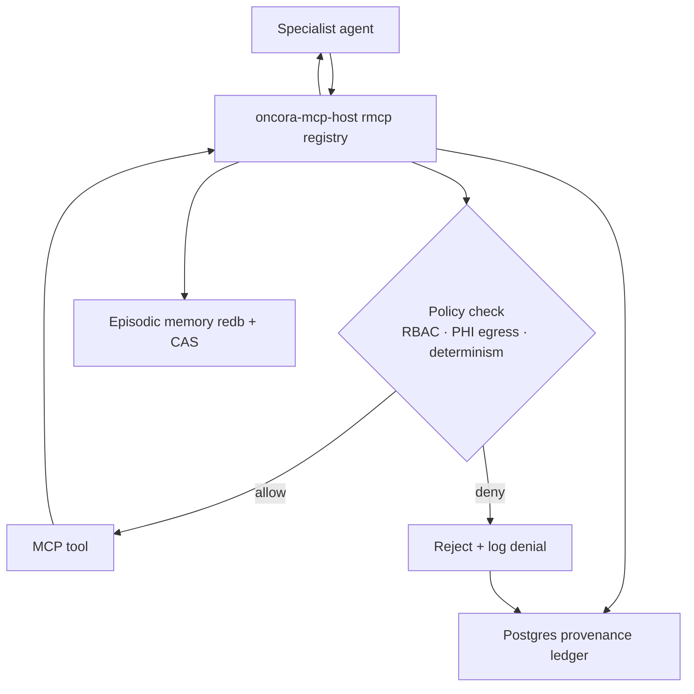

# Contract — MCP Tools (`oncora-mcp-host` / `rmcp`)

> **Every** domain capability is an MCP tool (P-5). Oncora is both an MCP **host/client** (the
> agent runtime calling tools) and an MCP **server** (the in-house VCF, DICOM, and calculator
> servers, plus Oncora's own KG/retrieval/memory tools). One SDK — `rmcp` — covers both roles.
> Audit, determinism, and timeout enforcement live in **our** code (`oncora-mcp-host` + `tower`),
> not the SDK's.

## Invocation contract (every tool call)

1. **Resolve** the requested tool to its server via the `rmcp` registry.
2. **Policy check** — RBAC scope, PHI-egress, determinism (FR-GOV-1).
3. **Validate** inputs (fuzz-tested via `cargo-fuzz`: VCF, DICOM, JSON tool args).
4. **Enforce** a `tower` timeout.
5. **Execute deterministically.**
6. **Record-before-return** — write the call (inputs, outputs, `ModelPin`, `SnapshotId`, `ToolCallId`,
   latency, verdict) to **both** episodic memory (`redb` + CAS) and the Postgres provenance ledger.
   A **denied** call is also recorded as an audit event.
7. **Return** the typed result to the agent — only after step 6.

## Tool servers & their tools

| Server | Built on | Tools (typed in / typed out) | Notes |
|---|---|---|---|
| **VCF / genomics** | `noodles` (pure Rust) | variant lookup → typed `Variant` records (locus, ref/alt, consequence, gene); cohort slicing via `polars`/`duckdb` over Parquet | Agents never touch raw files; PHI/IP stays on-prem |
| **DICOM / imaging** | `dicom-rs` (pure Rust) | study/series/instance parse; de-identified feature/embedding extraction | **De-identification enforced at the boundary**; pixel data + PHI stay on-prem; only de-identified features/embeddings indexed (`lancedb`) |
| **Clinical calculators** | deterministic oracles | dose adjustment, BSA, creatinine clearance, response criteria, … | **Deterministic oracles**: outputs are ground truth the verifier checks against; a calculator does not hallucinate; flag out-of-domain inputs |
| **Knowledge graph** | `oncora-kg` (`oxigraph`+`cozo`) | SPARQL ontology queries; Datalog evidence queries; entity resolution | Also acts as a deterministic oracle for grounding |
| **Retrieval / memory** | `oncora-retrieval`/`oncora-memory` | hybrid retrieve; memory read/write | Internal Oncora-hosted tools |

## Contract guarantees

- **Determinism + content-addressing** ⇒ the audit trail is replayable: `oncora-cli` can re-run any tool call
  and reproduce its output bit-for-bit (P-6).
- **Oracles are authoritative.** A mismatch between the LLM answer and a calculator/KG oracle drives
  `UncertaintySources.tool` toward 1.0 and can force `Abstain { OracleDisagreement }` regardless of model
  confidence; **never override a calculator/KG with prose** (FR-UNC-3, spec §9).
- **Genomics/imaging parsers behind the boundary** — though `noodles`/`dicom-rs` are pure Rust, the MCP
  boundary means a parsing bug cannot reach the agent core directly (P-1).
- **Cancellation.** A cancelled/timed-out run drops in-flight tool calls; they are recorded as dropped in
  episodic memory (FR-AGT-4).

**Implemented (prototype).** `oncora-mcp-host` ships an in-memory host by default and, under `--features
rmcp`, an `rmcp`-backed MCP **server** (exposing Oncora's tools) plus a **client** routing an external MCP
server's tools through the same `ToolHost` trait — verified by an in-process loopback test.
