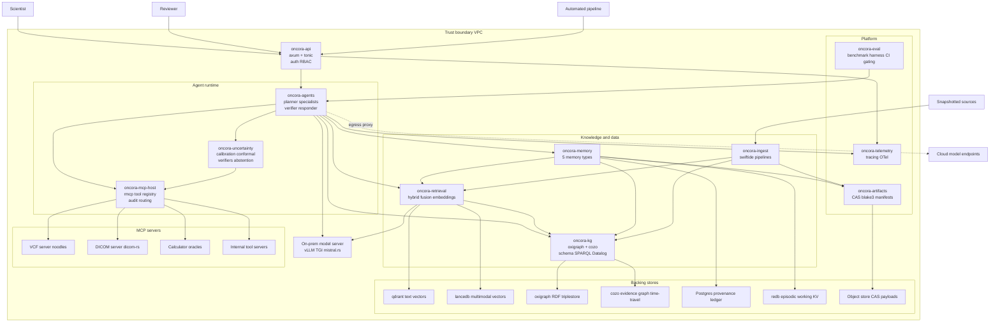
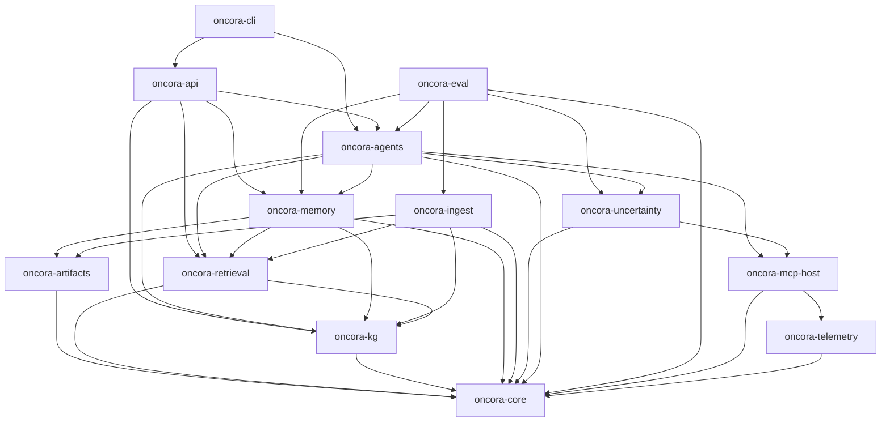
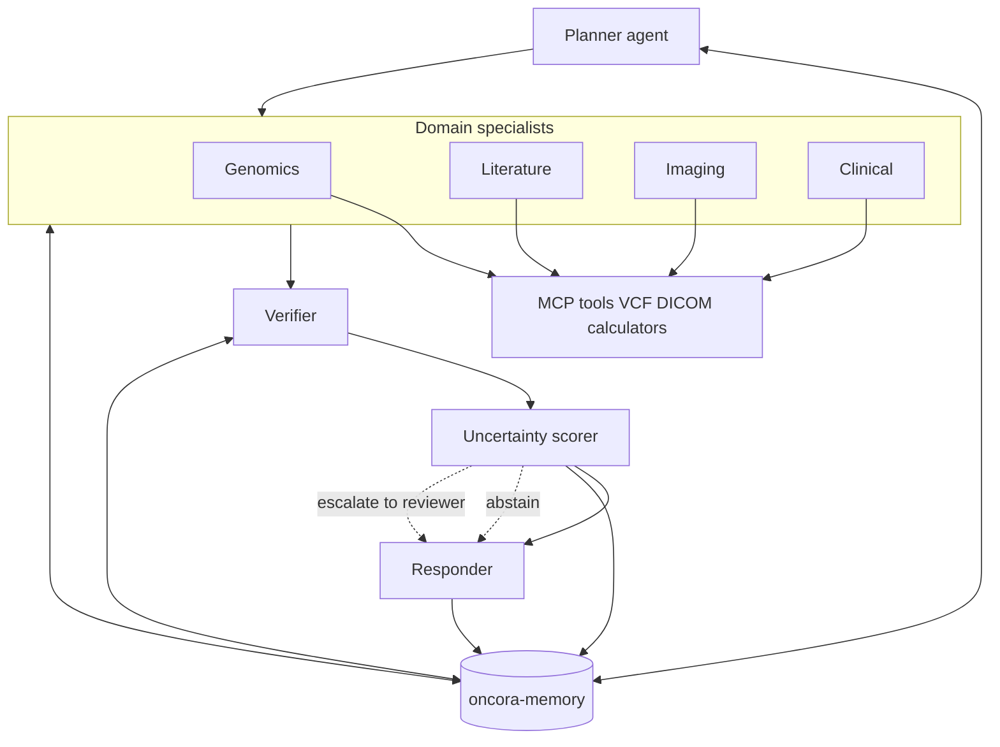
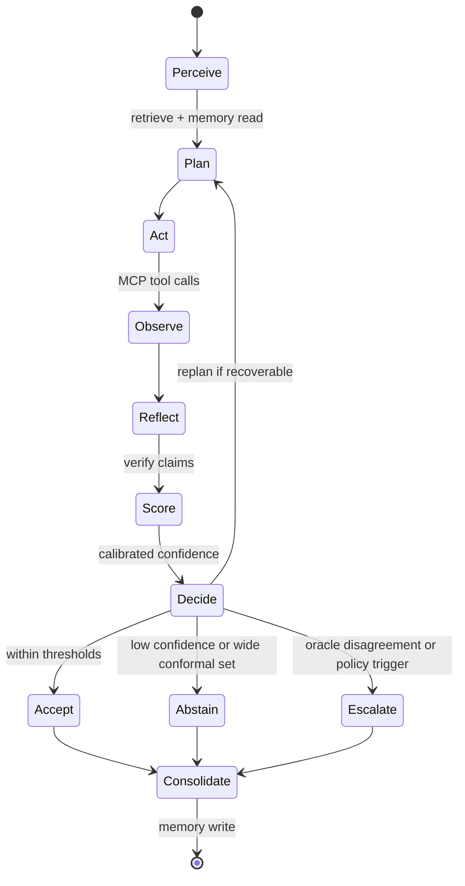
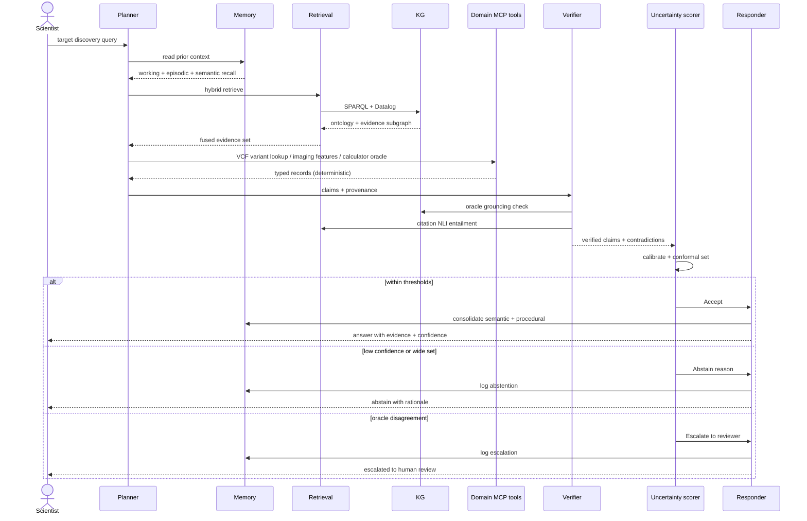

# Oncora Technical Plan

> The **how**. This plan operationalizes [spec.md](spec.md) under the constraints of
> [constitution.md](constitution.md). Technology choices are justified in
> [research.md](research.md); types and schema in [data-model.md](data-model.md);
> interfaces in [contracts/](contracts/); sequencing in [tasks.md](tasks.md).

---

## 1. Architecture overview

Oncora is a single Cargo **workspace** (`oncora`), every crate namespaced `oncora-*`,
organized as a clean-architecture DAG whose dependencies point **inward toward
`oncora-core`** (P-9). `oncora-core` holds the typed vocabulary (`Confidence`,
`Provenance`, `Evidence`, `Verdict`, ids, errors) and the nine provider trait
definitions; every concrete backend (and thus every third-party/non-Rust dependency)
is an isolated impl of one of those traits.

**One codebase, two deployment shapes:** the same crates run as a single all-in-one
binary on a laptop and as a fleet of stateless workers behind a load balancer in a VPC;
the difference is configuration (`figment`/`config` layered env + file), not code (NFR-SCALE-1).

### 1.1 Trust boundary (P-2)

The trust boundary is the VPC. Inside live every Oncora service, every backing store, the
on-prem model server, and the internal MCP servers. The **only** sanctioned outbound path is
the explicit, deny-by-default, audited **egress proxy** for opt-in cloud model endpoints.
Hard rules: no writes to source data (P-3); provenance on every claim (P-4);
deterministic, audited tool calls (P-5); pinned models/snapshots + content-addressed
artifacts + deterministic replay (P-6).

### 1.2 C4 container view

The diagram preserves the canonical dependency direction: arrows point inward toward
`oncora-core` (omitted as a node — it is the shared type/trait substrate every crate links).
Backing stores and MCP servers are concrete providers behind core traits.

---

## 2. Component breakdown (crates)

Foundational crates have no internal deps; dependencies point inward; **no cycles**.

| Crate | Responsibility | Internal deps | Implements FR |
|---|---|---|---|
| `oncora-core` | Typed vocabulary + nine provider trait definitions; ids; `thiserror` errors. Depends on nothing internal. | — | substrate for all |
| `oncora-telemetry` | Structured `tracing` + OpenTelemetry; span helpers correlating runs/tool calls. | — | NFR-OBS-1 |
| `oncora-artifacts` | Content-addressed store (CAS): BLAKE3 hashing, `serde`/CBOR manifests, object-store/FS backend. Backbone of replay. | core | FR-ING-2/3, P-6 |
| `oncora-mcp-host` | `rmcp` host/client; tool registry; deterministic + audited dispatch; record-before-return. | core, telemetry | FR-AGT-3, P-5 |
| `oncora-kg` | Dual KG: `oxigraph` ontology + `cozo` evidence graph; canonical schema; SPARQL/Datalog. | core | FR-KG-* |
| `oncora-retrieval` | Hybrid retrieval (vector + graph + recency fusion); embeddings behind `EmbeddingProvider`. | core, kg | FR-RET-* |
| `oncora-ingest` | `swiftide` streaming pipelines for literature/omics/imaging/KG; snapshotting into CAS; never writes to source. | core, kg, retrieval, artifacts | FR-ING-* |
| `oncora-memory` | Five memory types + write/read paths; cross-session persistence; `LedgerStore`. | core, kg, retrieval, artifacts | FR-MEM-* |
| `oncora-uncertainty` | Calibration (ECE), conformal prediction, verifiers, oracle grounding, abstention/escalation policy. | core, mcp-host | FR-UNC-* |
| `oncora-agents` | `rig`-backed planner / specialists / verifier / scorer / responder; the agent loop; orchestration concurrency + MCP routing. | core, memory, retrieval, kg, mcp-host, uncertainty | FR-AGT-* |
| `oncora-eval` | Benchmark harness, golden sets, metrics, CI gating. Legitimately depends on "all". | core, agents + all | FR-EVAL-* |
| `oncora-api` | `axum` (HTTP) + `tonic` (gRPC); auth; RBAC; sole entry point. | agents, memory, retrieval, kg | FR-API-1, FR-GOV-1 |
| `oncora-cli` | Operator/developer CLI incl. deterministic replay. | api / agents | FR-CLI-1 |

`oncora-eval` sits high in the graph and is depended on only by the binaries that invoke it.

### 2.1 Dependency graph

### 2.2 Pillar / requirement → crate mapping

| Pillar / requirement | Delivering crate(s) |
|---|---|
| Multimodal reasoning | `oncora-retrieval`, `oncora-kg`, `oncora-ingest`, `oncora-agents` |
| Agent memory architecture | `oncora-memory`, `oncora-kg`, `oncora-artifacts` |
| Robustness & uncertainty | `oncora-uncertainty`, `oncora-core` types, `oncora-mcp-host` oracles |
| Reliability & benchmarking | `oncora-eval`, `oncora-telemetry` |
| MCP for all domain tools | `oncora-mcp-host` |
| Provenance on every claim | `oncora-core` `Provenance`, `oncora-artifacts`, `oncora-memory` ledger |
| Reproducibility / replay | `oncora-artifacts`, `oncora-cli` replay, pinned toolchain + `Cargo.lock` |
| Typed calibrated confidence | `oncora-core` `Confidence`/`Verdict`, `oncora-uncertainty` |
| On-prem / privacy / RBAC | `oncora-api` auth+RBAC, on-prem provider impls behind core traits |
| Observability | `oncora-telemetry` |
| Provider swappability | `oncora-core` traits + per-backend impls in owning crates |

---

## 3. Agent runtime & orchestration

### 3.1 Topology (FR-AGT-1)

Fixed pipeline with memory read/written throughout: **Planner → Domain Specialists →
Verifier → Uncertainty Scorer → Responder**. The planner decomposes the task and dispatches
to specialists (genomics, literature, imaging, clinical) that call domain MCP tools; the
verifier checks claims against retrieved sources and oracle outputs; the scorer assigns
calibrated confidence and computes a `Verdict`; the responder answers, abstains, or escalates.

### 3.2 The agent loop (FR-AGT-2)

Memory is **read at perceive** and **written at consolidate**; the loop terminates in one of
three verdicts.

### 3.3 Concurrency model (NFR-PERF-1)

Built on `tokio` with **structured concurrency per run**:

| Concern | Mechanism | Rationale |
|---|---|---|
| Cancellation | per-run `CancellationToken` | One token cancels the whole run subtree on timeout/abort/disconnect |
| Tool/model timeouts | `tower` timeout layers | Uniform per-tool deadlines; no unbounded waits |
| Backpressure | bounded `tokio::mpsc` channels | Producers block rather than balloon memory |
| Concurrency limits | `tokio::sync::Semaphore` | Cap concurrent model + per-server tool calls to protect GPUs and oracles |
| Structured scope | task tracker / `JoinSet` per run | Child tasks owned by the run; nothing outlives its parent |

Specialists run concurrently under a shared semaphore; the planner fans out then joins.
A cancelled/timed-out run propagates the token so in-flight tool calls are dropped and
recorded as such in episodic memory.

### 3.4 MCP tool routing (P-5)

`oncora-mcp-host` is the single chokepoint: it holds the `rmcp` registry, resolves a tool to
its server (VCF/`noodles`, DICOM/`dicom-rs`, calculators, internal servers), enforces a
`tower` timeout, executes **deterministically**, and records the call to episodic memory + the
provenance ledger with a `ToolCallId`. Tool inputs are validated and fuzz-tested (`cargo-fuzz`).
Calculators and KG act as **deterministic oracles** the verifier checks against.

---

## 4. End-to-end target-discovery workflow

Memory is read once at perceive (cross-session context keyed by `(scientist, project,
workflow)`) and written at consolidate (accepted findings promote toward semantic memory and
successful plans toward procedural; abstentions/escalations logged with reason). Every artifact
carries its snapshot id and model pin, so the entire run is replayable.

---

## 5. Data-flow narrative

A run threads four currents through the system:

1. **Knowledge in.** Snapshots flow through `oncora-ingest` (`swiftide`) into three sinks: the
   KG (`oxigraph` canonical entities + `cozo` evidence graph), the vector indexes (`qdrant` text,
   `lancedb` multimodal), and CAS payloads. Ingest never mutates source; each indexed item is
   content-addressed and snapshot-tagged.
2. **Context out.** At perceive, `oncora-retrieval` fuses vector hits, graph queries, and
   recency/usage scores into a relevance-ranked context set under a token budget; `oncora-memory`
   overlays cross-session recall.
3. **Reasoning + grounding.** `oncora-agents` plans and dispatches specialists, which invoke domain
   tools via `oncora-mcp-host`. Tool calls hit deterministic oracles (calculators, KG) and parsers
   (`noodles`, `dicom-rs`). The verifier grounds claims; `oncora-uncertainty` calibrates, computes
   conformal sets, and emits a `Verdict`.
4. **Audit + provenance.** Every step is traced (`oncora-telemetry`), logged to episodic memory
   (`redb` + CAS), and attributed in the Postgres provenance ledger. Every returned claim carries
   `Provenance { sources, tool_calls, model, snapshot }`, and any run is replayable via `oncora-cli`.

The closed loop — snapshot in, evidence out, provenance recorded — is what makes Oncora
reproducible enough to publish.

---

## 6. Deployment plan (NFR-SCALE-1)

### 6.1 Dev — single node, embedded

For development, evaluation authoring, and CI: everything in-process or embedded; no external
services, no GPU, no egress.

| Concern | Dev choice |
|---|---|
| Process model | single all-in-one binary |
| Relational + provenance | SQLite via `sqlx` (pure-Rust `turso` chosen as embedded ledger) |
| Text vectors | embedded `hnsw_rs` / `instant-distance` |
| Multimodal vectors | `lancedb` local files |
| KG | `oxigraph` + `cozo` embedded (cozo deferred — see research.md §KG) |
| Working/episodic | `redb` file |
| CAS | local filesystem object store (BLAKE3) |
| Model | local `mistral.rs` / `candle` |
| Telemetry | `tracing` to stdout / local OTel |

### 6.2 Scaled — multi-node, service-backed

Stateless tier scales horizontally; every store becomes a managed VPC service.

| Concern | Scaled choice |
|---|---|
| Stateless agent tier | N replicas of `oncora-api` + `oncora-agents` behind LB |
| Retrieval tier | horizontally scaled `oncora-retrieval` workers |
| Text vectors | qdrant **cluster** (sharded + replicated) |
| Multimodal vectors | `lancedb` over shared object store |
| Relational + provenance | Postgres **HA** (primary + replicas) via `sqlx` |
| KG | `oxigraph` service + `cozo` service |
| Working/episodic | `redb` per-worker + Postgres rollup; FoundationDB optional at very large scale |
| CAS | object store (S3-compatible, on-prem) |
| Model serving | on-prem GPU vLLM/TGI OpenAI-compatible behind `ModelProvider` |
| Cloud model | opt-in only, via egress proxy |
| Telemetry | OTel collector → trace/metric backend |

The **only arrow that crosses the trust boundary is the audited egress proxy**.

### 6.3 Model endpoint abstraction

| Mode | Backend | Path | When |
|---|---|---|---|
| Dev local | `mistral.rs` / `candle` | in-process | Workstation, CI |
| On-prem served | vLLM / TGI OpenAI-compatible via `async-openai` | VPC-internal HTTP | **Default production** |
| Cloud opt-in | Anthropic / OpenAI-compatible | **egress proxy only** | Explicit, audited, non-PHI tasks |

### 6.4 Scaling model

| Tier | Stateless? | Scaling axis | Bottleneck | Mitigation |
|---|---|---|---|---|
| `oncora-api` + agents | Yes | Replicas behind LB | GPU model concurrency | Semaphore-bounded model calls; queue + backpressure |
| `oncora-retrieval` | Yes | Replicas | Embedding throughput | Batched `fastembed`; cache hot embeddings |
| qdrant | No | Shards + replicas | ANN over large corpora | Sharding; quantization; payload pre-filter |
| Postgres | No | Read replicas; vertical primary | Provenance write volume | Append-only ledger; partition by time |
| cozo / oxigraph | No | Vertical; read replicas | Time-travel query depth | Snapshot pinning; query budgets |
| Model server | No | GPUs / model replicas | Tokens per second | vLLM continuous batching; per-task model tiering |
| Object store CAS | No | Native object-store scale | Throughput | Native horizontal object store |

The hard ceiling is **GPU token throughput**; uncertainty-driven abstention is also a cost control —
the system does not burn tokens self-consisting on a question it should escalate.

### 6.5 Ops

OCI images per binary (multi-stage build); Kubernetes/Nomad in the VPC; layered config validated at
boot (`figment`/`config`); secrets fetched at runtime (Vault/KMS, short-lived); mTLS service-to-service
(`tonic` + `tower`); rolling deploys of the stateless tier; **expand-contract** schema migrations
(`sqlx migrate`, forward-only/backward-compatible); pinned image tags + reversible migrations for
rollback. **An upgrade is validated by replaying a golden set on the new build and diffing against the
recorded baseline; a rollback is re-pin + same replay + confirm empty diff** — never a guess. Backup/DR:
Postgres PITR, object-store versioning, KG snapshot export. Health/readiness probes via `axum`;
load-shed before OOM via `tower` concurrency-limit + `tokio` semaphores.

---

## 7. Security, privacy & governance plan (FR-GOV-*, NFR-PRIV-1, NFR-GXP-1)

- **Trust-boundary enforcement (layered, deny-by-default).** Stateless tier reachable only via the
  authenticated LB; data tier not internet-routable; egress proxy is the single sanctioned outbound path,
  allow-listing specific endpoints. Every caller authenticates at `oncora-api`; service-to-service is mTLS.
  Source snapshots are read-only. Model on-prem by default; cloud only through the proxy with PHI
  stripped/blocked and the fact recorded in the model pin.
- **Audit trail.** `oncora-mcp-host` validates inputs (fuzzed), resolves to the MCP server, enforces a
  timeout, executes deterministically, and records the call (inputs, outputs, model pin, snapshot,
  `ToolCallId`, latency, verdict) to **both** episodic memory and the Postgres ledger. Allow **and deny**
  are recorded; the agent receives a result only after the write (record-before-return).
- **Data lineage.** The append-only, content-addressed provenance ledger links every memory item, claim,
  and answer to sources, tool calls, model pin, and snapshot; tamper-evident; supports a full lineage walk.
- **RBAC & redaction.** RBAC at `oncora-api` re-checked at the MCP host policy gate; roles
  Scientist·Reviewer·Pipeline·Operator scoped per `(project, workflow)`; PHI tagged at ingest, redacted in
  logs/traces, blocked at egress; memory cross-tenant reads denied; reviewer gate on semantic promotions and
  escalations.
- **GxP-adjacent (ALCOA+).** Attributable, Legible & contemporaneous (`tracing`/OTel at action time), Original
  & accurate (content-addressed, no silent overwrite), Reproducible (pin + deterministic replay), Auditable
  (append-only ledger). Not a validated GxP system out of the box, but built to feed regulated work.

---

## 8. Engineering practices & reproducibility (NFR-QUAL-1, NFR-DOC-1, NFR-REPRO-1)

- **Workspace discipline.** Libs use `thiserror` (typed, matchable errors so verdict routing can branch on
  failure class); bins (`oncora-api`, `oncora-cli`, `xtask`) use `anyhow`. No library forces `anyhow` on callers.
  `[workspace.dependencies]` gives one pinned version per shared dep.
- **Quality gates (CI; PR cannot merge unless all pass).** `cargo fmt --all --check`;
  `cargo clippy --all-targets --all-features -- -D warnings`; `cargo deny check` (licenses, advisories,
  banned/duplicate crates, allowed sources — where native deps are gate-kept); `cargo test --workspace` with
  `cargo llvm-cov` floor on core/uncertainty/memory; `proptest` invariants + scheduled `cargo-fuzz`;
  `criterion` regression tracking; the `oncora-eval` golden-set gate.
- **Reproducibility criteria.** Pinned toolchain (`rust-toolchain.toml`); committed `Cargo.lock`;
  BLAKE3-addressed models/snapshots/manifests/outputs; `oncora-cli replay`; `insta` locks on prompts/traces/manifests.
- **Repo automation.** `xtask/` hosts snapshot pinning, deny audits, codegen (`cargo xtask <task>`); `fuzz/`
  holds `cargo-fuzz` targets (VCF, DICOM, tool args); ADRs in `docs/adr/NNNN-*.md`.

The payoff (P-9): any backend swaps by writing one impl crate/module and rebinding a trait object at
composition time, with zero changes to `oncora-agents` or above.
